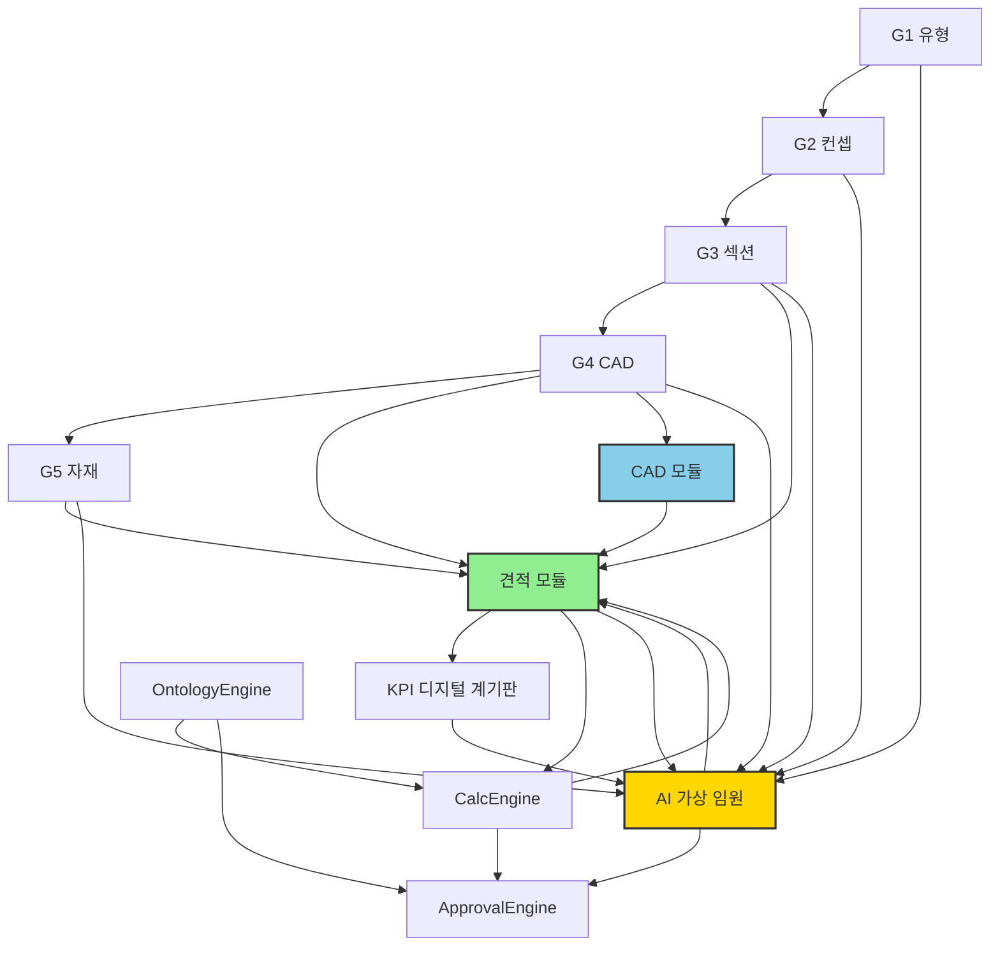
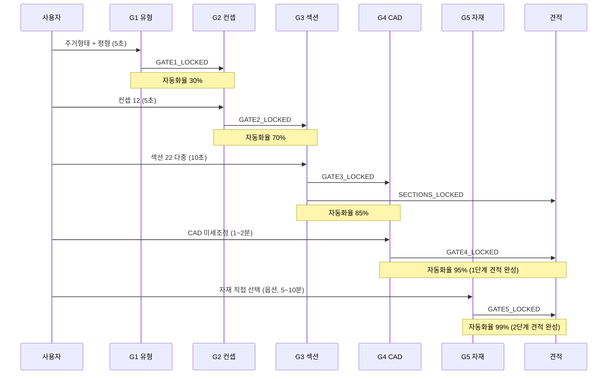
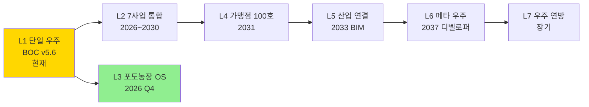
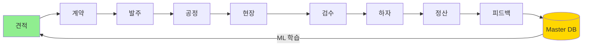
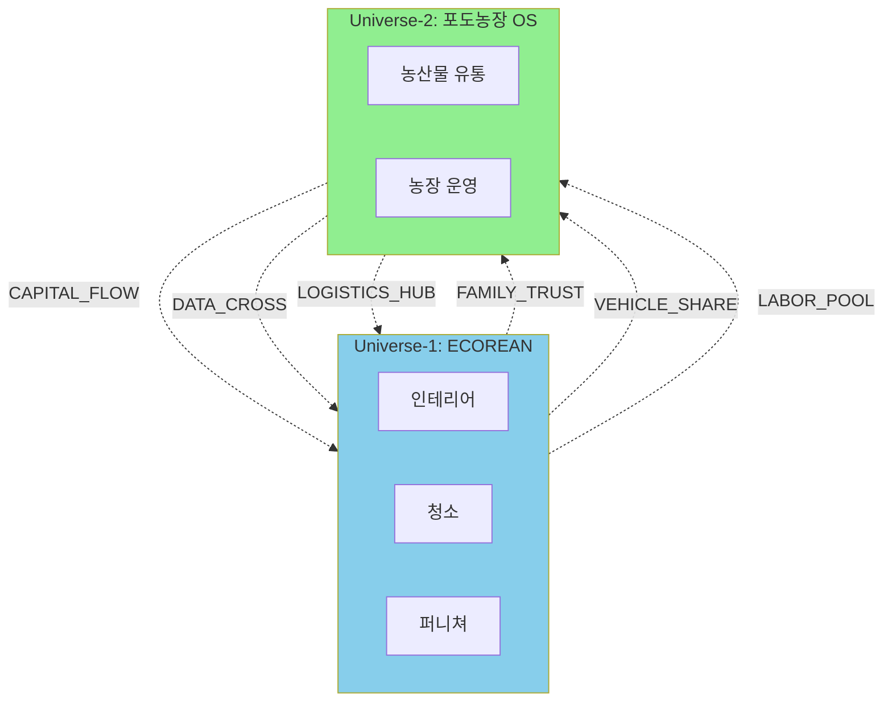

# ECOREAN BOC — Master Plan v5.7
최종 확정: 2026-04-29
이전 버전: v5.6 (2026-04-28)

---

## 변경 이력

| 버전 | 날짜 | 주요 변경 |
|------|------|-----------|
| v1.0 | 2026-04 초 | 초기 설계 |
| v2.0 | 2026-04-20 | 5개 엔진 확정, TDD 원칙 추가 |
| v3.0 | 2026-04-23 | Neo4j Readiness Layer, 3D 온톨로지 |
| v3.5 | 2026-04-25 | §1~§24 전체 확정, 개발순서 고정 |
| v4.0 | 2026-04-27 | §50~§54 도면자산화 전략 추가 |
| v5.0 | 2026-04-27 | §55~§90 완전 통합본, 4부록 추가 |
| v5.4 | 2026-04-27 | §91~§103 자동 연동 시스템, 부록 E·F·G 추가 |
| **v5.5** | **2026-04-28** | **시공 섹션 8→22개, 공간 타입 18→23개, 컨셉 10→12개, 주거 형태·2단계 견적·KPI·사업 범위 §104~§108, 부록 H~L 추가** |
| **v5.6** | **2026-04-28** | **§109~§113 노드/엣지 그래프 + 메타 온톨로지 호환 + AI 가상 임원 + L3 외부 우주, 부록 M~O 추가** |
| **v5.7** | **2026-04-29** | **§114~§116 9주 Phase 3 완주 + 부록 P~Q (Closed Loop 4모듈 + ML Phase 1)** |

### v5.6 주요 변경 사항 (2026-04-28)

| 항목 | 이전(v5.5) | 이후(v5.6) | 변경 유형 |
|------|-----------|-----------|----------|
| 시스템 구조 | 평면 9탭 | **노드/엣지 그래프 (11 노드 + 24 엣지)** | 신규 §109 |
| 메타 호환 | 없음 | **6+α 인터페이스 (URI/JSON-LD/RDF/Universe)** | 신규 §110 |
| AI 가상 임원 | 없음 | **14번째 엔진, 자동/승격 분리** | 신규 §111 |
| 외부 우주 진입 | 미정 | **2026 하반기 포도농장 OS** | 신규 §112 |
| 메타엣지 결정권 | 미정 | **자동 룰 + 대표님 단독** | 신규 §113 |
| 시각화 | 없음 | **Mermaid + Cytoscape.js 토폴로지 화면** | 부록 M·N·O |

> **v5.5 → v5.6 호환성**: 모든 v5.5 결정사항 100% 유지. 추가/확장만 적용.

### v5.5 주요 변경 사항 (2026-04-28)

| 항목 | 이전(v5.0) | 이후(v5.5) | 변경 유형 |
|------|-----------|-----------|----------|
| 시공 섹션 | 8개 | **22개 (4그룹)** | 확장 |
| 공간 유형 | 18개 | **23개 (+단독주택 5개)** | 확장 |
| 컨셉 | 10개 | **12개 (+한국모던/스마트홈)** | 추가 |
| 평형 프리셋 | 24평/30평 | **5단계 (24/30/34/40/50평+)** | 확장 |
| 주거 형태 | 미정 | **6개 (아파트/빌라/단독 등)** | 신규 §104 |
| 자동 연계 흐름 | 부분 | **전체 STEP 0→6 완전 자동화** | 신규 §105 |
| 2단계 견적 | 미정 | **1단계(2분)+2단계(10분)** | 신규 §106 |
| KPI 계기판 | 기본 | **11항목 디지털 LCD** | 신규 §107 |
| 사업 범위 | 미정 | **가능/부분/불가 명시** | 신규 §108 |

> **v5.0 → v5.5 호환성**: 모든 v5.0 결정사항 유지. 추가/확장만 적용. 기존 코드 영향 없음.

---

## 1. 시스템 정의
BOC = Build Operation Center
견적→계약→발주→공정→현장→검수→하자→정산→피드백→DB업데이트 (Closed Loop)
인테리어 공사 전체 생애주기를 단일 플랫폼에서 운영

## 2. 핵심 철학
1. 사람이 아닌 시스템이 판단
2. 현장 데이터가 시스템을 성장시킴
3. 대표 승인 없이 Master DB 변경 불가
4. 모든 데이터가 Neo4j로 순환
5. 버그 없는 구조 (TDD 강제)
6. 100배 확장 가능 구조
7. 성장형 시스템 (모든 항목 CRUD 필수)

## 3. 기술 스택
프론트엔드: Electron + HTML 모듈
DB 운영: SQLite (로컬, 오프라인 작동)
DB 지식: Neo4j (온톨로지 Knowledge Graph)
상태공유: IPC (Electron BrowserView)
3D 시각화: Three.js r128 (CDN)
웹버전: PC앱 완성 후 포팅 (Next.js)
사진저장: PC 로컬 폴더 + 클라우드 백업

## 4. 파일 구조
```
ecorean-os/
├── shell/
│   └── boc-shell.html
├── modules-html/
│   ├── estimate.html
│   ├── projects.html
│   ├── presets.html
│   ├── reports.html
│   ├── approval.html
│   ├── dbmgr.html
│   ├── ontology.html
│   ├── aiengine.html
│   └── dashboard.html
├── shared/
│   ├── engine/boc-engine.js
│   ├── store/boc-state.js
│   ├── db/schema.sql
│   └── boc-design.css
├── electron/
│   ├── main.js
│   └── preload.js
└── docs/
    └── MASTER_PLAN.md
```

## 5. 탭 구성 (9개)
1. 견적 마법사
2. 프로젝트
3. 프리셋
4. 보고서
5. 승인함
6. DB관리
7. 온톨로지
8. AI엔진
9. 대시보드(CEO)

## 6. 탭별 상세 설계

### 탭1 견적 마법사
미니 CAD (Fabric.js):
- 공간 그리기 (드래그, 100mm 스냅)
- 공간별 스페이스 카드 (바닥재/벽재/천장/창호/도어)
- 창호·도어 규격 직접 입력
- 면적 자동 계산 (창호·도어 공제)
- 공간별 예상 견적 실시간
- CAD 기호 표시 (문호 방향), 치수선 자동
- 전체화면 모드 / PNG·DXF 내보내기
- PDF 도면 파싱 자동 입력

STEP0 컨셉 선택:
**시공섹션 22개 (v5.5 확정, 4그룹):**

A. 주거 공간 (6개) — 필수:
  1. 거실 (LIVING)  2. 침실 (BEDROOM 통합)  3. 주방 (KITCHEN)
  4. 욕실 (BATHROOM)  5. 발코니/테라스  6. 현관 (ENTRANCE)

B. 부가 공간 (6개) — 평형/필요시:
  7. 드레스룸  8. 서재 (STUDY)  9. 식당 (DINING)
  10. 팬트리  11. 다용도실  12. 파우더룸

C. 특수 공간 (5개) — 단독/대형:
  13. 보일러실  14. 복도 (HALLWAY)  15. 계단 (STAIRS)
  16. 옥상 (ROOFTOP)  17. 지하/다락 (BASEMENT/ATTIC)

D. 공정 — 전체 영향 (5개):
  18. 배관 (PLUMBING)  19. 전기 (ELECTRIC)  20. 창호 (WINDOW)
  21. 단열/외벽 (INSULATION)  22. 외장/지붕 단독 (EXTERIOR)

**컨셉 12개 (v5.5 확정):**
심플모던/미니멀화이트/내추럴우드/빈티지레트로/스칸디나비안/클래식럭셔리/아시안젠/인더스트리얼/프로방스/컨템포러리/**한국모던**(NEW)/**스마트홈**(NEW)
선택 즉시 STEP1~5 기본값 자동입력, 커스텀 가능

STEP1 건물기본: 현장명/건물유형/연식/층수/엘리베이터/거주중(+10%)/지역/담당소장
STEP2 공간실측: 미니CAD 연동, 가로×세로×천장고(mm), 면적 자동계산 (오차율 ±2~3%)
STEP3 기존상태: 배관재질/보일러연식/분전반용량/방수하자/석면의심, RuleEngine 자동판단
STEP4 공사범위: 온톨로지 26개 자동적용, [자동]뱃지, DiagEngine 실시간경고
STEP5 자재등급: 전체패키지(표준1.0/고급1.3/프리미엄1.7), 브랜드별 실공급가
STEP6 견적결과: 공급가/도급/VAT포함최종, ㎡단가/평단가, 공정별 금액 테이블, 예상공기, 발주D-Day

### 탭2 프로젝트
상태: draft/estimated/contracted/in_progress/completed
하위메뉴: 견적서/공정표/공사일보/현금출납부/재무상태표/발주관리/완료보고

### 탭3 프리셋
시공섹션×컨셉 조합 저장/불러오기, CRUD 가능, 프리셋 선택→견적마법사 자동입력

### 탭4 보고서
고객용견적서/내부원가보고서/발주서/공정표PDF/정산서
보고서 템플릿 커스터마이징: 로고/도장/회사명/계좌/약관

### 탭5 승인함
DB단가보정요청/온톨로지규칙추가/새공정추가/브랜드단가수정
승인 즉시 Master DB 반영, Approval Log (불변기록)

### 탭6 DB관리
계단식 4단계 분류: 대분류→중분류→소분류→규격
관리항목: 공정DB(622개)/자재DB/브랜드DB/온톨로지규칙/인건비DB/지역계수/하자유형/외주업체
삭제원칙: status=disabled (실제삭제금지)

### 탭7 온톨로지
Three.js r128 3D 네트워크 그래프, 민들레 형태
관계선: AUTO(골드실선)/CONDITIONAL(주황점선)/FORCED(빨강실선)/PRECEDES(흰색화살표)/AFFECTS_COST(빨강파선)
인터랙션: 드래그 회전/휠 줌/클릭 연결노드만/더블클릭 중심/검색
최대 100개 노드 표시

### 탭8 AI엔진
학습데이터 게이지 (목표 500건): 0~49 수동/50~99 통계/100~499 XGBoost/500+ 딥러닝
크롤러 현황, 도면파싱 (PDF/DXF→STEP2 자동입력), 보정제안 [승인][거절]

### 탭9 대시보드(CEO)
오늘 현금흐름 / 진행현장 (수익률/위험도/공정률) / 이번달 KPI
미수금 D-Day / 승인대기 / RED ALERT (방수실패/발주초과/예산초과/미수금장기)

## 7. 계산 공식
```
공급가 = qty × (1+wr) × (lb×pm + mt×matMul)
도급   = 공급가 × 1.15
최종   = 도급   × 1.10  (VAT)

pm: 표준1.0 / 고급1.3 / 프리미엄1.7
양중: 5층+8% / 10층+15% / 15층+20% / 엘없음+30%
거주중: +10%
```

## 8. DB 스키마 (SQLite)

### 프로젝트
```
projects:       id/name/address/buildType/buildAge/floorLevel/hasElev/resid
                region/manager/status/contractAmount/startDate/endDate/conceptId/sections
spaces:         id/projectId/name/type/width/length/height/floor/wet/windows/doors
                floorMat/wallMat/ceilMat/cadX/cadY
estimates:      id/projectId/grade/gradeMul/selectedProcessIds/autoProcessIds
                totalSupply/contractAmount/finalAmount/duration/lines/validUntil
```

### 공사관련
```
daily_reports:  id/projectId/date/weather/completedProcesses/workers
                issues/defects/tomorrowPlan/progressRate/photos
cash_ledger:    id/projectId/date/type/category/subCategory/amount
                payMethod/vendor/memo/paid
purchase_orders:id/projectId/processId/itemName/quantity/unit
                unitPrice/totalPrice/vendor/leadDays/orderDate/deliveryDate/status
```

### DB관리
```
cost_items:     itemId/itemName/level1/level2/level3/level4/unit
                laborCost/materialCost/wasteRate/duration/formula
                spaceTypes/isRequired/dataStatus/status/updatedAt
ontology_rules: ruleId/trigger/linked/triggerType/condition
                confidenceLevel/status/approvedBy/approvedAt/source
approval_log:   id/requestType/targetId/action/beforeValue/afterValue
                reason/approvedBy/approvedAt
presets:        id/name/sections/conceptId/grade/gradeMul
                selectedProcessIds/materialOverrides/customizations
concepts:       conceptId/name/grade/gradeMul/priceMin/priceMax
                defaultProcessIds/materialDefaults/status
sections:       sectionId/name/processIds/description/status
```

### 도면 자산화 (v4.0+)
```
floorplan_library: patternId/building/area/bayType/direction/yearBuilt
                   source/confidence/verified/usageCount/createdAt/updatedAt
ai_crawl_log:   id/sourceUrl/capturedAt/buildingName/address
                parsedData/confidence/status/legalReview
```

## 9. IPC 통신 구조
```
모듈→Main: state:set / db:query / db:execute / kpi:update / tab:switch
Main→모듈: state:changed / db:result / kpi:refresh
```

## 10. 사용자 권한 (3단계)
```
Level1 대표:      전체제어 / 승인 / 설정 / CEO대시보드
Level2 BOC직원:   견적 / 프로젝트 / 재무 / DB수정요청 / 보고서
Level3 현장관리자: 담당현장 공사일보 / 공정표 / 발주요청

견적마법사 접근:
  내부(Level1~2): 원가+마진 전체
  소장(Level3):   조회만 (원가숨김)
  고객:           웹사이트 별도 경량버전 (최종금액만)
```

## 11. 백업 정책
- 로컬 자동백업: 일 1회
- 외부드라이브: 주 1회
- 클라우드: 실시간 (OneDrive/구글드라이브)
- 사진: PC 로컬폴더 + 클라우드 자동업로드

## 12. 다중 현장
현장별 독립 운영, 인력 충돌 감지+경고 (강제조정없음), 전사 통합 대시보드

## 13. 오프라인 작동
- 핵심: 완전 오프라인 (견적/공사일보/현금출납부/공정표)
- 부가: 인터넷 필요 (크롤러/Neo4j/클라우드백업)
- 동기화: 인터넷 연결시 자동

## 14. 고객 포털
URL 링크 공유 (비밀번호없음), 공사진행률+사진+공정표 공유, 웹버전 완성후 구현

## 15. 알림 시스템
앱내 알림 + 카카오톡
대상: 발주D-Day / 예산초과 / 미수금 / 승인요청 / 완료보고

## 16. 멀티 디바이스
클라우드 경유 실시간 동기화, 대표PC + 소장태블릿 + 직원PC, 오프라인 후 자동 동기화

## 17. 견적 유효기간
30일 고정, 발행시점 단가 고정, 만료 3일전 알림, 만료시 재계산 알림

## 18. 데이터 이전
BOC부터 새로 시작, 추후 Excel 임포트 기능 구조 준비

## 19. 연동 안전 보장
단일 진실 원천(SQLite), 이벤트 브로드캐스트, 검증 레이어, 버전관리+롤백

## 20. 성장형 CRUD
모든항목 CRUD 가능, 삭제=status:disabled, Master DB 변경=대표승인 필수, Approval Log 불변기록

## 21. Neo4j 순환 구조
모든 데이터→Neo4j→온톨로지학습→견적/공정/리스크/단가/이익률보정→(반복)

**노드:** Project/Space/Process/Material/Brand/Vendor/LaborCrew/DailyReport
CashLedger/Income/Expense/PurchaseOrder/PaymentMilestone/FinancialStatement
OntologyRule/LearningSuggestion/Defect/Risk/Case/MLModel/Franchise
FloorplanPattern/AiCrawlLog

**관계:** HAS_SPACE/HAS_PROCESS/USES_MATERIAL/REQUIRES_LABOR/SUPPLIED_BY
BRAND_OF/HAS_PAYMENT/NEEDS_INSPECTION/HAS_DEFECT/HAS_RISK
GENERATES_LEARNING/NEEDS_APPROVAL/UPDATES_MASTER_DB/PRECEDES
DEPENDS_ON/AFFECTS_COST/AFFECTS_SCHEDULE/TRIGGERS/LEARNED_FROM
CRAWLED_FROM/MATCHES_PATTERN/DERIVED_FROM

## 22. AI 성장 구조
- 크롤링: 표준품셈/노임단가/자재물가/시공사례
- 도면파싱: PDF/DXF/CAD→면적자동
- 공사일보→패턴감지→온톨로지규칙제안
- ML: 0~49수동/50~99통계/100~499XGBoost/500+딥러닝
- 고급AI: Causal+ActiveLearning+Federated
- 도면자산화: Phase 0~4 단계 진화

## 23. 개발 원칙
1. 설계확정→테스트작성→코딩→검증→커밋
2. 버그있는코드 커밋절대금지
3. TDD강제 / 발견즉시수정
4. 코드보다 설계먼저
5. 디자인은 맨 마지막

## 24. 개발 순서
```
1.  schema.sql
2.  electron/main.js (IPC+SQLite)
3.  shared/engine 테스트 보강
4.  estimate.html
5.  projects.html
6.  presets.html
7.  reports.html
8.  approval.html
9.  dbmgr.html
10. ontology.html
11. aiengine.html
12. dashboard.html
13. 디자인 적용 (shared/boc-design.css)
14. 웹버전 포팅 (Next.js)
15. 현장 투입
```

## 25. 입력 표준화 (InputNormalizer)
```typescript
InputNormalizer {
  normalizeArea(raw: string): number         // "33평" → 109.09
  normalizeDate(raw: string): string         // "다음주월" → "2026-05-04"
  normalizeMoney(raw: string): number        // "5천만" → 50000000
  normalizeAddress(raw: string): AddressObj  // 도로명/지번 통합
  normalizeProcess(raw: string): ProcessId   // 유사어 매핑
}
```

## 26. STEP별 데이터 명세
```
STEP0: { sectionIds[], conceptId }
STEP1: { name, buildType, buildAge, floor, hasElev, resid, region, manager }
STEP2: { spaces[]: { name, type, w, h, ceilH, floorMat, wallMat, ceilMat, windows[], doors[] } }
STEP3: { pipeType, boilerAge, panelCap, isFlat, hasLeak, asbestos }
STEP4: { processIds[], autoIds[], risks[] }
STEP5: { grade, gradeMul, brandOverrides{} }
STEP6: { totalSupply, contract, final, duration, lines[], validUntil }
```

## 27. 견적→공정표→발주 자동 흐름
```
견적 확정
  → ScheduleEngine.buildGantt(lines, startDate)
  → Gantt{tasks[], criticalPath[], duration}
  → 각 task에서 leadDays 역산 → orderDate
  → purchase_orders 자동 생성
  → D-Day 알림 스케줄 등록
```

## 28. DB 라이프사이클
```
생성:  INSERT + createdAt + status='active'
수정:  UPDATE + updatedAt (승인 필요 항목은 approval_log 선행)
삭제:  UPDATE SET status='disabled' + updatedAt (실제 DELETE 금지)
복원:  UPDATE SET status='active'
조회:  WHERE status='active' (기본값)
감사:  approval_log 전체 이력 조회
```

## 29. 완료보고 학습 파이프라인
```
완료보고 입력
  → 예상 vs 실제 오차 계산
  → 오차 > 임계치 → 보정제안 생성 (approval_log)
  → 대표 승인
  → cost_items 업데이트
  → OntologyEngine 재학습
  → ML 학습 데이터 추가
  → 다음 견적 정확도 향상
```

## 30. 동적 패턴 감지 엔진
```
공사일보 N건 누적
  → PatternDetector.scan(dailyReports)
  → 빈도 높은 공정 조합 추출
  → 기존 온톨로지와 비교
  → 신규 패턴 → 규칙 후보 생성
  → 대표 검토 → 승인 시 OntologyEngine 반영
```

## 31. CEO 의사결정 지원
```
대시보드 RED ALERT 트리거:
  수익률 < 5%
  미수금 > 계약금 70%
  종료일 < 오늘 (미완료)
  잔여공기 < 7일 && 공정률 < 80%

알림 채널: 앱내 + 카카오톡
자동 행동: 독촉 메시지 초안 생성
```

## 32. 4단계 무결성 검증
```
Layer 1 입력 검증:    타입/범위/필수값 확인
Layer 2 비즈니스 검증: 논리 일관성 (예: 착공 > 계약)
Layer 3 DB 검증:      외래키/유니크 제약
Layer 4 감사 검증:    approval_log 불변성 확인
```

## 33. 견적 파이프라인 4단계
```
Stage 1 수집:    사용자 입력 → InputNormalizer → ValidatedInput
Stage 2 계산:    CalcEngine.calculate(input) → EstimateLines[]
Stage 3 강화:    OntologyEngine.applyRules(lines) → EnrichedLines[]
Stage 4 출력:    ReportGenerator.generate(lines) → {pdf, json, preview}
```

## 34. 도면 파싱 어댑터 패턴
```typescript
interface FloorplanAdapter {
  name: string
  fromAddress(address: string): Promise<FloorplanData>
  fromImage(buf: Buffer): Promise<FloorplanData>
  fromPDF(buf: Buffer): Promise<FloorplanData>
  health(): Promise<boolean>
}

// 구현체 (Phase별 순차 도입)
class ManualAdapter     implements FloorplanAdapter  // Phase 0 (지금)
class TogalAdapter      implements FloorplanAdapter  // Phase 1
class ClaudeVisionAdapter implements FloorplanAdapter // Phase 1
class HybridAdapter     implements FloorplanAdapter  // Phase 2+
```

## 35. AI 추출값 vs 사람 보정값
```
floorplan_data {
  ai_area:    number   // AI 추출 (자동)
  human_area: number   // 현장 실측 (사람)
  final_area: number   // human_area ?? ai_area
  confidence: number   // AI 신뢰도 0~1
  source:     string   // 'ai' | 'human' | 'hybrid'
}
```

## 36. 도면 파싱 정확도 게이트
```
confidence < 0.5  → 거부, 사용자 수동 입력 요청
confidence 0.5~0.8 → 경고 표시, 확인 요청
confidence > 0.8  → 자동 적용
```

## 37. 단가 데이터 상태 관리
```
dataStatus:
  'official'   → 표준품셈/노임단가 (공식)
  'crawled'    → 크롤러 자동수집
  'corrected'  → 현장 실측 보정 (승인 완료)
  'estimated'  → 추정값 (검증 필요)
  'deprecated' → 구버전 (참조용)
```

## 38. ECOREAN 진짜 해자 보호
1. **단가 DB**: 현장 실측 누적 → 시장 평균보다 정확
2. **온톨로지**: 공사 경험 자동 학습 → 규칙 지속 성장
3. **도면 자산**: 시공 누적 + AI크롤 → 한국 1위
4. **고객 데이터**: 이전 이력 = 재계약 경쟁력
5. **AI 보정**: 오차율 지속 감소 → 정확도 독보적

## 39. 시장 경쟁사 분석

| 경쟁사 | 강점 | 약점 |
|--------|------|------|
| 오늘의집 | 브랜드/소비자 | 시공 관리 없음 |
| 인테리어말 | B2B 견적 | 단순 기능 |
| 아키스케치 | 도면 | 시공 연결 없음 |
| **ECOREAN** | **전 주기 통합 + AI** | **초기 데이터** |

## 40. 한국 도면 자체 학습 로드맵
```
0개월  → 수동 입력
3개월  → 시공 누적 30건
6개월  → 외부 API 연동 + 표준 패턴 50건
12개월 → AI크롤 500건 + 자체 200건
24개월 → 자체 5,000건
36개월 → 자체 20,000건 (한국 1위)
```

## 41. 평면도 열람 시스템 (4계층)
```
1계층: 사용자 직접 입력 (지금)
2계층: 도면 업로드 파싱 (지금)
3계층: 주소 기반 자동 조회 (Phase 1)
4계층: AI 자동 크롤링 (Phase 3)
```

## 42. 도면 파싱 → STEP2 데이터 매핑
```
평면도 파싱 결과
  totalArea  → STEP1.area
  rooms[]    → STEP2.spaces[]
    type     → space.type
    w/h      → space.width/length
    windows  → space.windows[]
    doors    → space.doors[]
  confidence → UI 경고 표시
```

## 43. 승인 게이트 매트릭스

| 변경 유형 | 승인자 | 즉시반영 | 로그 |
|-----------|--------|----------|------|
| 단가 ±5% 이하 | Level2 | O | O |
| 단가 ±5% 초과 | Level1 | O | O |
| 온톨로지 규칙 추가 | Level1 | O | O |
| 공정 신규 추가 | Level1 | O | O |
| 브랜드 단가 | Level2 | O | O |
| DB 스키마 변경 | Level1 | X (배포) | O |

## 44. 모듈 간 동기화 정책
```
AppState 변경 시:
  1. IPC broadcast (state:changed)
  2. 각 모듈 onTabSwitch 수신
  3. 필요 모듈만 re-render
  4. DB 변경은 approval_log 후 broadcast

우선순위:
  긴급: RED ALERT → 즉시 push
  일반: KPI 업데이트 → 5분 주기
  배치: 보고서/통계 → 요청시
```

## 45. 견적서 버전 관리
```
estimates 테이블:
  version:     number (1, 2, 3...)
  parentId:    string | null (수정 이전 견적)
  validUntil:  string (발행일+30일)
  frozenPrices: JSON (발행시점 단가 스냅샷)
  status:      'draft' | 'issued' | 'expired' | 'accepted'

규칙:
  발행 후 단가 변경 시 frozenPrices 유지
  만료 후 재계산 시 version+1
  원본 삭제 금지
```

## 46. 권한 시스템 강화
```
JWT 토큰 구조:
  { userId, level, name, exp, iat }

권한 체크 위치:
  IPC 수신 시 (main.js)
  DB 쓰기 전 (approval gate)
  UI 렌더링 (메뉴/버튼 표시)

세션 만료: 8시간 (업무일 기준)
재인증: 비밀번호 재입력
```

## 47. 프로젝트 단계 전환 명세
```
draft → estimated:    견적 저장 시 자동
estimated → contracted: 계약금 입력 시
contracted → in_progress: 착공일 도래 또는 수동
in_progress → completed:  완료보고 제출 시
any → cancelled:     수동 (Level1만)

전환 시 자동 액션:
  contracted:    공정표 생성, 발주 D-Day 등록
  in_progress:   공사일보 템플릿 활성화
  completed:     학습 파이프라인 트리거
```

## 48. 외부 API 위험 관리
```
위험 1 서비스 종료:
  대응: Adapter 패턴 (교체 용이)
  예비: 대체 API 목록 유지

위험 2 비용 급증:
  대응: L1/L2/L3 캐싱으로 80% 절감
  예비: 월 한도 알림 + 자동 차단

위험 3 정확도 저하:
  대응: confidence gate (0.8 이상만 자동)
  예비: 사람 검토 fallback

위험 4 법적 리스크:
  대응: §54 법적 준수 가이드라인 준수
  예비: 법무 자문 정기 진행
```

## 49. 시스템 진화 로드맵
```
Phase 0 (지금~3개월):  1인 운영, SQLite, 로컬
Phase 1 (3~6개월):     직원 합류, 외부 API, 클라우드 백업
Phase 2 (6~12개월):    팀 운영, 자체 도면 라이브러리 시작
Phase 3 (1~2년):       AI 크롤러, Neo4j Aura, 프랜차이즈 준비
Phase 4 (2~3년):       한국 1위 인테리어 플랫폼 목표
```

---

## 50. 도면 시스템 단계별 진화

### Phase 0 (지금 ~ 3개월): 코딩 우선
- 도면 모듈 미구현
- 미니 CAD 수동 입력 중심
- 시공 현장 도면 자동 저장
- 외부 API 어댑터 인터페이스만 준비

### Phase 1 (3~6개월): 외부 API 연동
- TogalAdapter / ClaudeVisionAdapter 구현
- 주소 → 외부 API 호출 → 결과 저장
- 캐싱 시작 (L1/L2/L3)

### Phase 2 (6~12개월): 자체 라이브러리 시작
- 표준 패턴 매칭 시스템
- 시공 현장 누적 가속
- 외부 API + 자체 DB 하이브리드

### Phase 3 (1~2년): AI 크롤러 도입
- 백그라운드 자동 크롤링
- 부동산 사이트 모니터링
- Claude Vision 자동 추출
- 자체 형식 변환, 라이브러리 자동 확장

### Phase 4 (2~3년): 자체 자산 우위
- 자체 DB 80% 활용
- 외부 API 의존 최소
- 한국 1위 도면 자산

### 어댑터 인터페이스 (Phase 0 준비)
```typescript
interface FloorplanAdapter {
  fromAddress(address: string): Promise<FloorplanData>
  fromImage(imageBuffer: Buffer): Promise<FloorplanData>
  fromPDF(pdfBuffer: Buffer): Promise<FloorplanData>
}
interface FloorplanData {
  totalArea: number
  rooms: RoomData[]
  confidence: number
  source: string
  cachedAt: string
}
```

---

## 51. AI 크롤링 시스템 (장기 설계)

### 동작 방식
1. 일일 자동 실행 (스케줄러)
2. 부동산 사이트 검색 (네이버부동산/호갱노노/직방/다방)
3. 새 평면도 발견 → Claude Vision API 호출
4. 평면도 → 자체 형식 JSON 변환
5. 자동 검증 (신뢰도 체크) → 라이브러리 등록
6. 출처 메타데이터 저장

### 법적 준수
- robots.txt 준수, API rate limit 준수
- 자체 형식 변환 (디자인 카피 아님)
- 사실 정보만 추출 (면적/방수), 원본 이미지 저장 금지

### 기술 스택
Puppeteer (자동화) / Claude Vision API / 자체 검증 엔진 / 자동 분류 시스템

### 안전장치
출처별 호출 한도 / 비용 한도 알림 / 법적 검토 게이트 / 자동 차단 시스템

---

## 52. 캐싱 정책 강화

### 3단계 캐싱

| 레벨 | 유효시간 | 용도 | 크기 |
|------|----------|------|------|
| L1 메모리 | 1시간 | 즉시 재접근 | 100MB |
| L2 디스크 | 7일 | 세션 간 공유 | 1GB |
| L3 자체DB | 영구 | 보정된 데이터 | 무제한 |

### 우선순위
```
요청 → L1 → L2 → L3 → 외부 API → 사용자 입력
```

### 비용 효과

| 구분 | API 호출 | 월 비용(예시) |
|------|----------|--------------|
| 캐싱 없음 | 같은 주소 5회 = 5회 | 100만원 |
| 캐싱 적용 | 같은 주소 5회 = 1회 | 20만원 |
| **절감** | | **80% 절감** |

---

## 53. 도면 자산화 로드맵

| 시점 | 건수 | 구성 |
|------|------|------|
| 0개월 | 0건 | — |
| 3개월 | 30건 | 시공 누적 |
| 6개월 | 110건 | 시공 60 + 표준 50 |
| 1년 | 900건 | 시공 200 + 표준 200 + AI크롤 500 |
| 2년 | 5,000건+ | 전방위 수집 |
| 3년 | **20,000건+** | **한국 1위** |

### 라이브러리 구조
```
floorplan_library/
├── apt/   (24p_3bay / 30p_3bay / 34p_4bay / 40p_tower)
├── villa/
├── house/
└── office/
```

---

## 54. 법적 준수 가이드라인

### 한국 저작권법 분석

| 유형 | 저작물성 | 위험도 |
|------|----------|--------|
| 일반 아파트 평면도 | 부정 | 안전 |
| 독창적 건축 설계 | 인정 | 위험 |
| 워터마크/표시 도면 | 명확한 권리 | 위험 |

### 안전한 활동
✅ 자체 도면 제작 / AI로 새로 그리기 / 사용자 동의 도면 / 시공 현장 도면

### 위험한 활동
❌ 다른 사이트 도면 직접 다운로드 / 워터마크 도면 / 라이선스 위반 / DB 권리 침해

### AI 크롤링 안전 원칙
1. 사실 정보만 추출 (면적/방수)
2. 자체 형식으로 변환
3. 원본 이미지 미저장
4. 출처 메타데이터만 보존
5. 디자인 카피 금지
6. 법적 검토 정기 시행

---

## 55. 보안·개인정보 보호

### 저장 보안
- SQLite 암호화: SQLCipher 적용 (AES-256)
- 백업 파일 암호화: 동일 키 사용
- 사진 파일: 별도 암호화 (Phase 1)

### 사용자 인증
```
인증 방식: JWT (로컬 발급)
토큰 만료: 8시간 (업무일 기준)
비밀번호:  bcrypt (salt rounds 12)
세션 잠금: 30분 비활동 시 자동 잠금
```

### 접근 로그
```
access_log: userId / action / targetTable / targetId
            timestamp / ipAddress / result
보존 기간:  3년 (법적 의무)
```

### 데이터 마스킹 (권한별)
```
Level3 (소장): 원가/마진 필드 → "***"
고객 포털:     계약금액만 표시, 단가 숨김
```

### 정기 보안 감사
- 월 1회: 접근 로그 이상 패턴 검토
- 분기 1회: 취약점 점검
- 연 1회: 외부 보안 감사 (Phase 2+)

---

## 56. 재해 복구 전략

### 복구 목표
```
RTO (복구 목표 시간): 1시간
RPO (복구 목표 시점): 1시간 이내 데이터
```

### 백업 무결성 자동 검증
```
매일 자동:
  1. 백업 파일 해시 확인
  2. 백업 열기 테스트
  3. 핵심 테이블 레코드 수 확인
  4. 이상 감지 시 즉시 알림
```

### 정기 복구 테스트 (월 1회)
```
테스트 절차:
  1. 백업 파일 → 임시 DB 복원
  2. 핵심 기능 동작 확인
  3. 결과 기록 (복구성공/실패/시간)
```

### 지리적 분산 백업
```
로컬:  C드라이브 (즉시)
외장:  외부 드라이브 (주간)
클라우드: OneDrive / Google Drive (실시간)
원격:  NAS (Phase 1+)
```

### 재해 복구 매뉴얼
1. 장애 감지 → 알림 수신
2. 최신 백업 파일 확인
3. 새 환경에 앱 설치
4. 백업 복원 실행
5. 데이터 무결성 확인
6. 정상 운영 재개

---

## 57. 성능·확장성 한계

### SQLite 임계점
```
프로젝트 수:  5,000건 (쿼리 속도 저하 시작)
daily_reports: 50,000건 (인덱스 필수)
cash_ledger:   100,000건 (파티셔닝 고려)
```

### 자동 모니터링
```
모니터링 항목:
  DB 파일 크기 > 500MB → 경고
  쿼리 응답 > 200ms    → 최적화 검토
  메모리 사용 > 80%    → 알림
  디스크 여유 < 10GB   → 경고
```

### PostgreSQL 전환 트리거
```
다음 중 하나 충족 시:
  동시 접속자 3명+
  DB 파일 > 2GB
  쿼리 응답 > 500ms (최적화 후)
  프랜차이즈 확장 시작
```

---

## 58. 사용자 교육·도움말

### 인앱 가이드 (첫 사용)
```
첫 실행 시:
  1. 환영 화면 (시스템 소개)
  2. 첫 프로젝트 생성 가이드
  3. 견적 마법사 튜토리얼
  4. 공사일보 입력 연습

완료 시: 가이드 숨김 (재활성화 가능)
```

### 도움말 시스템
- F1: 현재 화면 도움말
- 툴팁: 복잡한 필드에 (?) 아이콘
- 동영상: YouTube 링크 (Phase 1)
- 매뉴얼 PDF: 설치 시 포함

### 단축키

| 단축키 | 기능 |
|--------|------|
| Ctrl+N | 새 프로젝트 |
| Ctrl+E | 견적 마법사 |
| Ctrl+S | 저장 |
| Ctrl+P | 인쇄/PDF |
| Ctrl+F | 검색 |
| F5 | 새로고침 |

### 검색 기능
- 전역 검색: Ctrl+K
- 대상: 프로젝트명/현장명/고객명/공정명
- 결과: 모듈 직접 이동

---

## 59. 데이터 마이그레이션

### 인터페이스 준비 (Phase 0)
```typescript
interface MigrationAdapter {
  fromExcel(path: string): Promise<MigrationResult>
  fromCSV(path: string): Promise<MigrationResult>
  toPostgres(target: DBConfig): Promise<MigrationResult>
  validate(): Promise<ValidationReport>
}
```

### SQLite → PostgreSQL 전환 전략
```
1단계: 스키마 검증 (자동)
2단계: 데이터 복사 (배치)
3단계: 무결성 검증 (자동)
4단계: 읽기 테스트 (수동)
5단계: 트래픽 전환 (Blue-Green)
6단계: SQLite 백업 보존 (90일)
```

### 무중단 전환
```
Blue:  기존 SQLite 운영
Green: PostgreSQL 준비
전환:  DNS/Config 변경만 (30초)
롤백:  설정 복원 (30초)
```

---

## 60. 외주업체·협력사 통합

### 단계별 확장

| 단계 | 내용 | 시점 |
|------|------|------|
| 1단계 | DB 등록 (이름/연락처/단가) | 지금 |
| 2단계 | 협력사 전용 포털 | Phase 1 |
| 3단계 | 자동 발주 메시지 발송 | Phase 1 |
| 4단계 | 마켓플레이스 (입찰) | Phase 3+ |

### 협력사 DB 구조
```
vendors: id/name/type/contact/region
         specialty[]/rating/activeProjects
         paymentTerms/bankInfo/status
```

---

## 61. 고객 경험 강화

### 알림 강화
```
카카오 알림톡:
  - 공사 착공 알림
  - 주요 공정 완료
  - 사진 첨부 (주간 보고)
  - 잔금 청구 안내
  - 하자 조치 결과
```

### 고객 포털 (Phase 1)
```
URL: ecorean.kr/project/{uuid}
내용: 공사 진행률 / 사진 타임라인 / 공정표 / 다음 공정
권한: 조회만 (수정 불가)
```

### 웹사이트 통합 (Phase 2)
```
ecorean.kr:
  - 회사 소개
  - 포트폴리오 (완료 프로젝트)
  - 견적 신청 (경량 버전)
  - 고객 포털 로그인
```

---

## 62. AI 학습 품질 보증

### 입력 시점 이상치 감지
```
이상치 기준:
  단가: 평균 ±30% 초과
  면적: 입력값이 건물 가능 범위 초과
  공기: 공정 대비 비현실적 일정

처리: 경고 표시 + 확인 요청 (자동 거부 아님)
```

### 학습 데이터 검수
```
학습 전 자동 필터:
  완료 프로젝트만 포함
  이상치 제거 (±2σ)
  데이터 완전성 80% 이상

학습 후 검증:
  holdout set 20%
  이전 모델 대비 성능 비교
```

### 모델 성능 모니터링
```
KPI:
  견적 오차율 < 5% (목표)
  온톨로지 적중률 > 90%
  사용자 거절률 < 10%
```

### 잘못된 학습 자동 롤백
```
트리거:
  오차율 > 15% (이전 대비)
  사용자 거절률 > 30% 급증
  특정 공정 단가 50%+ 변동

처리:
  이전 버전 자동 복원
  이상 데이터 격리
  담당자 알림
```

---

## 63. 법규 변경 대응

### 크롤러 통합
```
법규 크롤러 대상:
  국토교통부 고시 (노임단가)
  표준품셈 개정 (한국건설기술연구원)
  지자체 건축 조례
  안전 규정 변경
```

### 변경 감지 시스템
```
감지 주기: 월 1회 (자동)
감지 방법: 해시 비교 (문서 변경 여부)
알림:      Level1 즉시 알림
```

### 영향 분석 자동화
```
변경 감지 시:
  1. 영향 받는 cost_items 목록 추출
  2. 변경 전/후 단가 비교 보고서
  3. 업데이트 승인 요청 생성
  4. 승인 후 일괄 반영
```

---

## 64. 실패 사례 학습

### 실패 분류 자동화
```
실패 유형:
  COST_OVERRUN    단가 초과 (N%)
  SCHEDULE_DELAY  공기 지연 (N일)
  DEFECT          하자 발생
  PAYMENT_DELAY   수금 지연
  SCOPE_CHANGE    공사 범위 변경
  DESIGN_ERROR    설계 오류
```

### 손실 패턴 분석
```
패턴 감지:
  특정 공정 조합 → 자주 단가 초과
  특정 건물 유형 → 공기 지연 빈번
  특정 지역 → 수금 지연 패턴

분석 결과:
  DiagEngine 경고 규칙 자동 생성
  견적 시 사전 경고 표시
```

### 사전 경고 시스템
```
견적 STEP4 단계에서:
  유사 조건 실패 사례 N건 발견 시
  → "유사 현장 XX% 비용 초과 이력"
  → 마진 추가 권장 알림
```

---

## 65. Voice First 인터페이스

### Whisper API 연동 (Phase 1)
```typescript
VoiceInput {
  record(): Promise<AudioBuffer>
  transcribe(audio: AudioBuffer): Promise<string>
  parseCommand(text: string): Command
  execute(cmd: Command): void
}
```

### 공사일보 음성 입력
```
사용자: "오늘 타일 작업 완료, 인원 3명, 특이사항 없음"
시스템:
  → completedProcesses: ['타일']
  → workers: [{ type:'타일공', count:3 }]
  → issues: ''
  → 확인 화면 표시
```

### 명령어 음성 실행
```
"새 프로젝트 만들어" → switchTab('estimate')
"대시보드 열어"      → switchTab('dashboard')
"오늘 일보 저장해"   → saveDailyReport()
"김철수 현장 보여줘" → filterProject('김철수')
```

---

## 66. 카메라 자동 측정 (AR/LiDAR)

### 도입 전략
```
Phase 0: 수동 입력 (지금)
Phase 1: 사진 기반 추정 (Claude Vision)
Phase 2: ARKit/ARCore 연동 (모바일 앱)
Phase 3: LiDAR 스캔 (iPad Pro 등)
```

### Phase 2 ARKit/ARCore
```
기능:
  - 카메라로 공간 스캔
  - 자동 면적 계산
  - 3D 포인트 클라우드 생성
  - STEP2 자동 입력

정확도 목표: ±3%
```

---

## 67. 블록체인 견적서

### 단계별 도입
```
지금:   PDF 전자서명 (Adobe Sign / 카카오)
2년 후: 블록체인 해시 등록 (Ethereum/Klaytn)
3년 후: NFT 견적서 (고가 프로젝트)
```

### 위변조 방지
```
지금 구현:
  1. 견적서 생성 시 SHA-256 해시
  2. hash → estimates.documentHash 저장
  3. 검증: 파일 해시 vs DB 해시 비교
  4. 위변조 감지 시 즉시 알림
```

---

## 68. 가상 견적 미팅 (3D)

### 단계별 구현
```
Phase 0 (지금):
  - Three.js 단순 3D 공간 시각화
  - 공간별 색상 구분
  - 공정별 가격 오버레이

Phase 2:
  - 정밀 3D (자재 텍스처)
  - 고객 공유 링크
  - 실시간 견적 변경

Phase 3:
  - VR/AR 지원
  - 자재 실물 매핑
```

---

## 69. 협력사 마켓플레이스

### 도입 결정
- **현재: 보류** (2년 후 재검토)
- 이유: 핵심 기능 완성 후 부가 사업 검토
- 조건: 매출 N억 달성 + 프랜차이즈 확장 시

### 마켓플레이스 구조 (예비 설계)
```
구매자:  ECOREAN 인테리어사
판매자:  자재업체/노무업체/장비업체
수수료:  거래액의 2~5%
검증:    ECOREAN 품질 인증 제도
```

---

## 70. 시공 영상 AI 분석

### 단계별 도입
```
Phase 1: Claude Vision API
  - 공사일보 사진 자동 분류
  - 공정 완료 자동 감지
  - 위험 상황 감지 (기본)

Phase 2: 안전 위반 감지
  - 안전모 미착용 감지
  - 위험 구역 침입 감지
  - 실시간 알림

Phase 3: 품질 판정
  - 시공 품질 AI 평가
  - 하자 예측
  - 준공 검사 지원
```

---

## 71. 디지털 트윈

### 단계별 구현
```
Phase 0 (지금): 단순 디지털 기록
  - 공사일보 + 사진 타임라인
  - 공정별 완료 이력
  - 자재 투입 기록

Phase 2: 3D 디지털 기록
  - 공간별 시공 이력
  - 자재 교체 이력
  - 하자 위치 3D 마킹

Phase 3: 정밀 디지털 트윈
  - 건물 전체 3D 모델
  - 설비 배관 위치 기록
  - 유지보수 예측 연동
```

### 평생 고객 락인
```
완공 후:
  - 건물 디지털 트윈 보관
  - 5년 후 재시공 필요 항목 예측 알림
  - "ECOREAN이 시공한 건물" → 재계약 우선
  - 이전 이력 = 재견적 50% 단축
```

---

## 72. AI 자동 문서 생성

### Claude API 활용
```typescript
DocumentGenerator {
  generateEstimate(project: Project): Promise<EstimatePDF>
  generateContract(project: Project): Promise<ContractPDF>
  generateInvoice(project: Project, amount: number): Promise<InvoicePDF>
  generateSpec(project: Project): Promise<SpecPDF>
  generateReport(project: Project): Promise<ReportPDF>
}
```

### 자동 생성 범위

| 문서 | 자동화율 | 사람 검토 |
|------|----------|-----------|
| 견적서 | 100% | 선택 |
| 계약서 | 80% | 필수 |
| 청구서 | 100% | 선택 |
| 시방서 | 70% | 권장 |
| 완료보고 | 90% | 선택 |

---

## 73. 스마트 발주 자동화

### 단계별 자동화

| 단계 | 기능 | 시점 |
|------|------|------|
| 1단계 | D-Day 알림 | 지금 |
| 2단계 | 추천 업체 제안 | Phase 1 |
| 3단계 | 자동 메시지 발송 | Phase 1 |
| 4단계 | AI 가격 협상 | Phase 2 |

### 자동 발주 메시지 (Phase 1)
```
수신: 협력사 연락처
내용:
  안녕하세요, [회사명]입니다.
  [현장명] 현장 [자재명] 발주 요청드립니다.
  수량: [N]개, 납기: [날짜], 현장: [주소]
  견적 회신 부탁드립니다.

발송: 카카오톡 / 문자 / 이메일 선택
```

---

## 74. 예측 유지보수

### 완료 데이터 기반 분석
```
수명 예측 모델:
  도배:     5~7년
  장판:     7~10년
  욕실 방수: 10~15년
  보일러:   15~20년
  창호:     15~20년
  전기 배선: 20~30년
```

### 5년 후 점검 알림
```
완공일 기준 자동 알림:
  2년 후: "도배 상태 점검 권장"
  5년 후: "전체 점검 권장"
  10년 후: "방수/창호 교체 검토"

알림 채널: 카카오 알림톡
```

### 재계약 영업 자동화
```
알림 수신 시:
  고객명 + 이전 시공 이력
  예상 재시공 범위 + 견적 (자동 생성)
  담당자 배정 자동화
  상담 예약 링크 첨부
```

---

## 75. 블록 크기 규칙

### 파일 크기 기준

| 상태 | 줄 수 | 처리 |
|------|-------|------|
| 정상 | 1,500 ~ 3,000 | 유지 |
| 경고 | 3,001 ~ 5,000 | 분할 계획 |
| 위험 | 5,001 ~ 7,500 | 분할 준비 |
| 금지 | 7,501+ | 즉시 분할 |

### 분할 원칙
- 의미 단위로 분할 (기능 경계 기준)
- 인터페이스로만 연결 (직접 참조 금지)
- 테스트 코드는 별도 블록

---

## 76. 표준 블록 패턴

### 4블록 분리 원칙
```
입력 블록 (1,500줄):
  - 사용자 입력 수집
  - 유효성 검사
  - 정규화

계산 블록 (2,000줄):
  - 핵심 로직
  - 엔진 호출
  - 결과 계산

결과 블록 (1,500줄):
  - 결과 가공
  - 포맷팅
  - 캐싱

출력 블록 (1,500줄):
  - UI 렌더링
  - PDF 생성
  - API 응답
```

---

## 77. 4계층 아키텍처

### 계층 구조
```
Layer 4 부가 블록 (옵션)
  AI문서생성 / Voice First / 영상분석 / AR측정
        ↓
Layer 3 모듈 블록 (9개 탭)
  estimate / projects / presets / reports
  approval / dbmgr / ontology / aiengine / dashboard
        ↓
Layer 2 엔진 블록
  CalcEngine / OntologyEngine / DiagEngine
  ScheduleEngine / FinanceEngine
        ↓
Layer 1 기초 블록
  DB / 보안 / 백업 / 인증 / 로깅
```

### 계층 규칙
- 상위→하위 의존만 허용
- 동일 계층 간 직접 의존 금지 (IPC/이벤트만)
- 하위→상위 콜백은 인터페이스로만

---

## 78. 행렬 확장 프로세스

### 분할 트리거
```
파일 7,500줄 도달 시:
  1. 의미 단위 분석 (기능 경계 추출)
  2. 4분할 계획 수립
  3. 인터페이스 먼저 정의
  4. 각 블록 독립 구현
  5. 통합 테스트 통과 확인
  6. 원본 파일 삭제
```

### 분할 후 구조
```
before: engine.js (7,500줄)
after:
  engine-input.js    (1,500줄)
  engine-calc.js     (2,000줄)
  engine-result.js   (1,500줄)
  engine-output.js   (1,500줄)
  engine-index.js    (200줄, 조합기)
```

---

## 79. 상위 적층 패턴

### 조합기 원칙
```typescript
// engine-index.js (조합기)
import { normalize }  from './engine-input'
import { calculate }  from './engine-calc'
import { format }     from './engine-result'
import { render }     from './engine-output'

export function process(raw: RawInput): Output {
  const input  = normalize(raw)
  const result = calculate(input)
  const formatted = format(result)
  return render(formatted)
}
```

### 금지 패턴
```typescript
// ❌ 금지: 블록 간 직접 import
// engine-output.js
import { calculate } from './engine-calc'  // 금지!

// ✅ 허용: 조합기를 통한 연결만
```

---

## 80. 인터페이스 표준

### TypeScript 강제
```typescript
// 모든 블록 진입/출구에 타입 명세 필수
interface BlockInput<T> {
  data: T
  requestId: string
  timestamp: string
  userId?: string
}

interface BlockOutput<T> {
  data: T
  requestId: string
  duration: number
  errors: BlockError[]
}

interface BlockError {
  code: string
  message: string
  field?: string
}
```

### 인터페이스 버전 관리
```
인터페이스 변경 시:
  v1 → v2: 신구 버전 동시 지원 (3개월)
  v2 안정화 후 v1 deprecated
  deprecated 후 6개월 → 제거
```

---

## 81. 의존성 관리

### 단방향 의존성
```
허용:  Layer N → Layer N-1
금지:  Layer N → Layer N+1 (역방향)
금지:  Layer N → Layer N   (순환)
```

### 순환 의존성 차단
```
자동 검사: 빌드 시 순환 감지
도구: madge (dependency-cruiser)
실패 조건: 순환 발견 시 빌드 실패
```

### 의존성 주입 패턴
```typescript
// 직접 import 대신 주입
class CalcEngine {
  constructor(
    private db: DatabaseAdapter,
    private ontology: OntologyAdapter,
  ) {}
}
// 테스트 시 Mock 주입 가능
```

---

## 82. 블록 통신 최적화

### 같은 프로세스: 함수 직접 호출
```typescript
// ✅ 최고 성능: 직접 호출
const result = CalcEngine.calculate(input)
```

### 메모리 공유: 불변 객체
```typescript
// ✅ 공유 상태는 항상 불변
const shared = Object.freeze({ rates, rules })
// ❌ 금지: 직접 변경
shared.rates.push(...)  // 에러 발생
```

### 캐싱 전략
```
L1: 함수 메모이제이션 (순수 함수만)
L2: AppState 캐시 (5분 TTL)
L3: SQLite 쿼리 결과 캐시 (변경시 무효)
```

---

## 83. 디버깅 시스템

### 통합 로깅 (Trace ID)
```typescript
interface LogEntry {
  traceId: string      // 요청 추적
  blockId: string      // 발생 블록
  level: 'debug' | 'info' | 'warn' | 'error'
  message: string
  data?: unknown
  timestamp: string
  duration?: number
}
```

### 블록 진입/출구 자동 로깅
```typescript
// 데코레이터로 자동 적용
@logBlock('CalcEngine.calculate')
function calculate(input: Input): Output {
  // 로깅 자동: 진입, 출구, 소요시간, 에러
}
```

### 시각화 도구
- 개발중: console.log + electron DevTools
- Phase 1: 내장 로그 뷰어 (앱 내)
- Phase 2: Grafana 연동 (팀 운영 시)

---

## 84. 자동화 도구

### 블록 스캐폴딩
```bash
# 새 블록 생성 (자동 파일 구조 생성)
npm run scaffold:block -- --name=NewFeature --layer=3

# 생성 파일:
# src/blocks/l3-new-feature/
#   index.ts       (진입점)
#   input.ts       (입력 검증)
#   calc.ts        (핵심 로직)
#   output.ts      (출력 포맷)
#   index.test.ts  (테스트)
```

### 테스트 자동 생성
```bash
# 기존 함수에서 테스트 골격 생성
npm run gen:test -- --file=calc-engine.ts

# 생성: 각 export 함수에 describe/it 골격
```

### 문서 자동 생성
```bash
# JSDoc → Markdown 변환
npm run docs:gen

# 결과: docs/api/*.md (블록별 API 문서)
```

---

## 85. 메타 온톨로지 정의

### 시스템 자체가 온톨로지
```
도메인 온톨로지:  인테리어 공정/자재/브랜드/규칙
시스템 온톨로지:  블록/레이어/인터페이스/의존성

통합 그래프:
  모든 블록 = Neo4j 노드
  모든 의존 = Neo4j 엣지
  Neo4j로 시스템 자체를 질의 가능
```

### 통합 목적
```
가능해지는 질의:
  "estimate.html이 사용하는 엔진 전부?"
  "FinanceEngine 변경 시 영향 받는 블록?"
  "Layer 3에서 DB를 직접 호출하는 곳?"
  "테스트 커버리지가 낮은 블록?"
```

---

## 86. 노드 타입 9종

```
SystemRoot   최상위 루트 노드
Layer        계층 노드 (Layer 1~4)
Module       탭 모듈 (9개)
Block        기능 블록 (38개)
Function     함수/메서드
DataModel    데이터 모델/스키마
Interface    TypeScript 인터페이스
Test         테스트 케이스
Documentation 문서
```

---

## 87. 엣지 타입 17종

### 시스템 엣지 12종
```
BELONGS_TO    블록 → 레이어 소속
DEPENDS_ON    의존 관계
CALLS         함수 호출
USES_DATA     데이터 모델 사용
IMPLEMENTS    인터페이스 구현
EXTENDS       상속/확장
TESTS         테스트 대상
DOCUMENTS     문서화 대상
TRIGGERS      이벤트 발생
LISTENS       이벤트 수신
COMMUNICATES  IPC 통신
INHERITS      타입 상속
```

### 도메인 통합 엣지 5종
```
PROCESSES    블록 → 도메인 데이터 처리
STORES       블록 → DB 테이블 저장
APPLIES      블록 → 온톨로지 규칙 적용
LEARNS_FROM  블록 → ML 학습 소스
MODIFIES     블록 → Master DB 수정
```

---

## 88. 메타데이터 표준

### 모든 블록 JSDoc 필수
```typescript
/**
 * @block CalcEngine
 * @layer 2
 * @parent shared/engine
 * @input  { EstimateInput }
 * @output { EstimateResult }
 * @errors { ValidationError, CalcError }
 * @depends OntologyEngine, DatabaseAdapter
 * @testCoverage 95%
 * @author udunext7-wq
 * @since v2.0
 */
export class CalcEngine { ... }
```

### 파일 헤더 표준
```typescript
/**
 * ECOREAN BOC — [블록명]
 * Layer: [N] | Block: [블록ID]
 * 책임: [한줄 설명]
 * 입력: [타입]
 * 출력: [타입]
 */
```

---

## 89. 시스템 온톨로지 통합

### Neo4j 통합 저장
```cypher
// 블록 노드 생성
CREATE (b:Block {
  id: 'calc-engine',
  name: 'CalcEngine',
  layer: 2,
  lines: 2000,
  testCoverage: 0.95
})

// 의존성 엣지
MATCH (a:Block {id:'estimate-calc'}), (b:Block {id:'calc-engine'})
CREATE (a)-[:DEPENDS_ON]->(b)

// 도메인 연결
MATCH (b:Block {id:'calc-engine'}), (t:DataModel {id:'cost-items'})
CREATE (b)-[:USES_DATA]->(t)
```

### Week 1 즉시 도입
```
Day 1: Neo4j 설치 + 스키마 정의
Day 2: 기존 블록 노드 일괄 등록
Day 3: 의존성 엣지 자동 추출 (madge)
Day 4: 도메인 노드 연결 (cost_items 등)
Day 5: 통합 쿼리 테스트
```

---

## 90. AI 통합 전략

### Claude API → Neo4j 쿼리
```
사용자: "estimate.html이 어떤 DB 테이블을 쓰나요?"

처리:
  1. Claude API: 자연어 → Cypher 변환
  2. Neo4j: Cypher 실행
  3. 결과: 블록 + 테이블 관계 반환
  4. Claude API: 결과 → 자연어 설명

Cypher 예시:
  MATCH (m:Module {name:'estimate'})-[:DEPENDS_ON*]->(b:Block)
  -[:STORES]->(t:DataModel)
  RETURN DISTINCT t.name
```

### 시스템 자기 인식
```
가능해지는 기능:
  "지금 시스템에서 가장 위험한 블록은?"
  "테스트 없는 코드가 사용하는 DB 테이블?"
  "단일 실패점(SPOF)이 되는 블록?"
  "변경 영향이 가장 큰 인터페이스?"
```

### AI 페어 프로그래밍
```
개발 시:
  Claude가 Neo4j 시스템 그래프 조회
  → 새 블록의 최적 위치 제안
  → 의존성 충돌 사전 감지
  → 인터페이스 자동 생성
  → 테스트 골격 자동 작성
```

---

## v5.0 확정 결정 사항 (2026-04-27)

### 도면 전략 (확정)
하이브리드 모델 — 초기: 외부 API → 중기: 병행 → 장기: 자체 80%+

### 블록 아키텍처 (확정)
4계층 / 7,500줄 분할 기준 / TypeScript 인터페이스 강제

### Neo4j 메타 온톨로지 (확정)
Week 1 즉시 도입 — 인테리어 + 시스템 온톨로지 통합

### AI 통합 (확정)
Claude API + Neo4j 자연어 쿼리 — Phase 1부터 적용

---

## 부록 A — 12주 개발 일정

| 주차 | 목표 | 완료 기준 |
|------|------|-----------|
| Week 1 | 마스터플랜 확정 + Neo4j 셋업 | schema.sql + Neo4j 노드 등록 |
| Week 2 | Layer 1 완성 (DB/보안/백업/인증/로깅) | 5개 기초 블록 테스트 통과 |
| Week 3 | Layer 2 엔진 강화 | 5개 엔진 116+ assert 통과 |
| Week 4~5 | 견적 마법사 (STEP0~6) | 전체 플로우 E2E 통과 |
| Week 6~9 | 프로젝트 모듈 (7개 하위탭) | 공사일보/재무/발주 완성 |
| Week 10 | 프리셋 + 보고서 | 5종 보고서 PDF 생성 |
| Week 11 | 승인함 + DB관리 | 승인 플로우 완성 |
| Week 12 | 온톨로지 3D + 대시보드 | RED ALERT 동작 확인 |

---

## 부록 B — 38개 블록 명세

### Layer 1 기초 (5개)
| 블록 | 책임 | 목표 줄수 |
|------|------|-----------|
| DB 블록 | SQLite 연결/쿼리/트랜잭션 | 1,500 |
| 보안 블록 | 암호화/복호화/해시 | 1,000 |
| 백업 블록 | 자동백업/복원/검증 | 1,200 |
| 인증 블록 | JWT/세션/권한 확인 | 1,000 |
| 로깅 블록 | 통합로깅/Trace ID | 800 |

### Layer 2 엔진 (5개 + 2개 추가)
| 블록 | 책임 | 현재 상태 |
|------|------|-----------|
| CalcEngine | 견적 계산 | ✅ 완성 |
| OntologyEngine | 규칙 적용 | ✅ 완성 |
| DiagEngine | 위험 진단 | ✅ 완성 |
| ScheduleEngine | 공정표/발주 | ✅ 완성 |
| FinanceEngine | 재무 계산 | ✅ 완성 |
| SecurityEngine | 보안 엔진 | Phase 1 |
| BackupEngine | 백업 엔진 | Phase 1 |

### Layer 3 모듈 (26개)
```
견적 마법사 (8개 블록):
  step0-concept / step1-building / step2-spaces
  step3-condition / step4-scope / step5-grade
  step6-result / estimate-save

프로젝트 (8개 블록):
  project-list / project-estimate / gantt-chart
  daily-report / cash-ledger / financial-statement
  purchase-order / completion-report

프리셋 (2개 블록):
  preset-list / preset-form

보고서 (4개 블록):
  report-customer / report-internal
  report-order / report-settlement

승인함 (2개 블록):
  approval-pending / approval-history

DB관리 (2개 블록):
  dbmgr-list / dbmgr-form
```

### Layer 4 부가 (옵션)
```
AI 자동 문서 (Phase 1)
Voice First (Phase 1)
시공 영상 분석 (Phase 2)
AR/LiDAR 측정 (Phase 2)
디지털 트윈 (Phase 3)
```

---

## 부록 C — Phase별 인프라 비용

| Phase | 기간 | 월 비용 | 주요 비용 |
|-------|------|---------|-----------|
| Phase 0 | 지금~3개월 | 0원 | 로컬 운영 |
| Phase 1 | 3~6개월 | 18만원 | 외부 API 5만 + 클라우드 13만 |
| Phase 2 | 6~12개월 | 50만원 | 자체 서버 + AI API 확대 |
| Phase 3 | 1~2년 | 150만원 | Neo4j Aura + Claude Vision + 크롤러 |
| Phase 4 | 2~3년 | 500만원+ | 엔터프라이즈 인프라 |

### 비용 절감 전략
- L1/L2/L3 캐싱으로 API 비용 80% 절감
- 자체 DB 비중 증가로 Phase 3→4 비용 완화
- 프랜차이즈 수수료로 인프라 비용 충당

---

## 부록 D — 시스템 진화 트리거

| 전환 | 트리거 조건 | 준비 기간 |
|------|-------------|-----------|
| Phase 0→1 | 직원 입사 OR 데이터 100GB 초과 | 2주 |
| Phase 1→2 | 사용자 5명+ OR AI 본격 사용 | 1개월 |
| Phase 2→3 | 외부 고객 요청 OR 매출 목표 달성 | 2개월 |
| Phase 3→4 | 매출 N억 OR 프랜차이즈 계약 | 3개월 |

### 트리거 모니터링
```
자동 추적 항목:
  동시 사용자 수
  DB 파일 크기
  월 API 비용
  프로젝트 수
  직원 수

임계치 도달 시:
  Level1 알림
  Phase 전환 체크리스트 자동 생성
```

---

---

## 91. 공간 타입 자동 마감 매트릭스 (핵심)

핵심 원칙:
미니 CAD에서 공간만 그리고 유형 선택
→ 모든 마감재/공정 자동 적용
→ 면적당 단가 자동 계산
→ 작업 시간 90% 단축

### 23개 공간 타입 정의 (v5.5 확정)

**그룹별 분류:**

| 그룹 | 공간 타입 | KEY |
|------|----------|-----|
| 거주 (5) | 거실, 안방, 침실, 작은방, 서재 | LIVING, MASTER_BEDROOM, BEDROOM, SMALL_BEDROOM, STUDY |
| 수도 (4) | 주방, 식당, 욕실, 파우더룸 | KITCHEN, DINING, BATHROOM, POWDER_ROOM |
| 보조 (8) | 발코니, 테라스, 옥상, 현관, 드레스룸, 팬트리, 다용도실, 보일러실 | BALCONY, TERRACE, ROOFTOP, ENTRANCE, DRESSING, PANTRY, UTILITY, BOILER |
| 연결 (2) | 복도, 계단 | HALLWAY, STAIRS |
| 단독주택 추가 (4) | 다락, 지하실, 차고, 마당 | ATTIC, BASEMENT, GARAGE, YARD |

**단독주택 전용 4개 (v5.5 신규):**
- ROOFTOP (옥상) — 방수, 데크, 조경
- ATTIC (다락) — 단열, 마감 최소
- BASEMENT (지하실) — 방수 강화, 환기
- GARAGE (차고) — 에폭시 바닥, 차단 도어
- YARD (마당) — 조경, 외장 블록

### 9개 공간 타입 상세 (핵심 공간)

**[1. 거실/응접실]**
- 바닥: 마루 (FL_HB)
- 벽면: 도장 (WALL_PAINT)
- 천장: 도장 (CEIL_PAINT)
- 부자재: 걸레받이(MLD_BASE), 몰딩(MLD_CROWN)
- 설비: 다운라이트(LGT_DL), 콘센트(㎡당 0.3개), TV배선
- 변경 옵션: 도배/포인트월/우물천장/헤링본

**[2. 침실/방]**
- 바닥: 마루 (FL_HB)
- 벽면: 도배 (WP_BASIC + WP_PRMR 자동)
- 천장: 도배 또는 도장
- 부자재: 걸레받이(MLD_BASE)
- 설비: 직부등, 콘센트(㎡당 0.4개)
- 변경 옵션: 도장/포인트월/무드등

**[3. 주방]**
- 바닥: 타일 (TILE_FL)
- 벽면: 타일(조리대 위 600~900mm) + 도장
- 천장: 도장
- 방수: CONDITIONAL
- 가구 자리: 싱크대/냉장고/렌지
- 설비: 환풍구(VENT_KIT), 가스배관, 전용콘센트
- 변경 옵션: 벽 도배/아일랜드/후드 업그레이드

**[4. 욕실]**
- 바닥: 타일 (TILE_BT)
- 벽면: 타일 (TILE_WL)
- 천장: SMC 또는 방수+도장
- 방수: AUTO 강제
- 부자재: 줄눈(GROUT) 자동
- 가구: 변기/세면대/욕조-샤워
- 설비: 환풍구(VENT_BT), 타올걸이
- 변경 옵션: 천장 SMC vs 페인트/욕조 vs 샤워/비데

**[5. 발코니/베란다]**
- 바닥: 데크타일 또는 우레탄
- 벽면: 방수 페인트
- 방수: CONDITIONAL
- 설비: 배수구
- 변경 옵션: 확장(거실 통합)/세탁실 전환

**[6. 현관]**
- 바닥: 타일 (TILE_ENT)
- 벽면: 도장 또는 도배
- 가구: 신발장(BUILT_IN_SHOE) 붙박이
- 설비: 센서등(LGT_SENSOR), 인터폰
- 변경 옵션: 대리석 바닥/벽 거울

**[7. 드레스룸]**
- 바닥: 마루
- 벽면: 도배
- 가구: 붙박이장 벽면 전체
- 설비: LED 라인 조명, 콘센트
- 변경 옵션: 환기 시스템/조명 강화

**[8. 다용도실/세탁실]**
- 바닥: 타일
- 벽면: 타일 (반높이)
- 방수: CONDITIONAL
- 설비: 세탁기 220V 콘센트, 배수
- 변경 옵션: 김치냉장고 자리 추가

**[9. 복도/계단]**
- 바닥: 마루 또는 타일
- 벽면: 도장
- 부자재: 걸레받이
- 설비: 센서등
- 변경 옵션: 포인트 벽

### 자동 마감 적용 알고리즘

```js
function autoApplyFinish(spaceType, dimensions) {
  const matrix = SPACE_FINISH_MATRIX[spaceType]
  const area = dimensions.width * dimensions.length / 1_000_000       // ㎡
  const perimeter = (dimensions.width + dimensions.length) * 2 / 1000 // m
  const wallArea = perimeter * dimensions.height / 1000 - windowDoorArea

  return {
    floor:    { id: matrix.floor,   qty: area },
    wall:     { id: matrix.wall,    qty: wallArea },
    ceiling:  { id: matrix.ceiling, qty: area },
    moldings: matrix.moldings.map(m => ({ id: m, qty: perimeter })),
    electric: {
      outlets: Math.ceil(area * matrix.outletDensity),
      switches: matrix.switchCount,
      lights:  Math.ceil(area / matrix.lightCoverage),
    },
    plumbing:   matrix.plumbing,
    waterproof: matrix.waterproof,
    furniture:  matrix.furniture,
  }
}
```

---

## 92. 건물 정보 자동 적용 시스템

STEP 1 입력 → 자동 결정

### 건물 연식 매트릭스

| 연식 | 자동 적용 공정 |
|------|---------------|
| 30년 이상 | PLB_PIPE 100% 교체 FORCED, ELE_PANEL 교체 권장, INSUL 단열재 추가, 새시 교체 권장, 양생 +20% |
| 20~30년 | 배관 검사 후 부분 교체, 분전반 점검, 보일러 연식 확인 |
| 10~20년 | 일반 리모델링, 부분 교체 |
| 10년 미만 | 미용 리모델링, 자재 교체만 |

### 층수 자동 양중비

| 층수 | 계수 |
|------|------|
| 1~4층 | ×1.0 (표준) |
| 5~9층 | ×1.08 |
| 10~14층 | ×1.15 |
| 15층+ | ×1.20 |
| 엘리베이터 없음 | ×1.30 (추가) |

### 거주중 보정

거주중 체크 시 자동 적용:
- 노무비 +10% (작업 효율 저하)
- BY_FURN 가구 보양 자동
- PARTITION 임시 격벽 자동
- 청소 횟수 ×2
- 폐기물 처리 강화

### 지역 보정 (region_coefficients 자동 적용)

| 지역 | 계수 |
|------|------|
| 강남구 | ×1.15 |
| 서울 일반 | ×1.0 |
| 광역시 | ×1.0 |
| 지방 | ×0.90~0.95 |

---

## 93. 기존 상태 자동 적용 시스템

STEP 3 입력 → 자동 결정

### 배관 재질 룰

| 재질 | 자동 결정 |
|------|----------|
| PB관 양호 | 부분 교체만 |
| 동관 | 부분 교체 (선택) |
| 갈바나이즈관 | 100% 교체 FORCED |
| PVC | 점검 후 결정 |

### 보일러 연식 룰

| 연식 | 자동 결정 |
|------|----------|
| 10년 이상 | 교체 권장 (옵션) |
| 15년 이상 | 교체 강제 |
| 20년 이상 | 분배기까지 전체 교체 FORCED |

### 분전반 용량 룰

| 용량 | 자동 결정 |
|------|----------|
| 30A 미만 | 60A+ 교체 FORCED |
| 30~50A | 교체 권장 |
| 60A+ | 유지 |

### 바닥 수평 룰

| 상태 | 자동 결정 |
|------|----------|
| 양호 | 직접 시공 |
| 보통 | 셀프레벨링 추가 |
| 불량 | 미장 + 셀프레벨링 FORCED |

### 방수 하자 룰

| 상태 | 자동 결정 |
|------|----------|
| 있음 | 철거 후 재방수 FORCED |
| 의심 | 진단 필요 (수동) |
| 없음 | 표준 |

### 석면 룰 (법적 의무)

| 상태 | 자동 결정 |
|------|----------|
| 의심 | 석면 검사 FORCED |
| 확인 | 자격업체 석면 처리 FORCED |

---

## 94. 공간 시너지 자동 인식

공간 조합 → 추가 공정 자동 적용

### 거실 + 주방 (오픈 키친)

감지 조건: 두 공간 인접 + 구분 벽 없음
자동 적용:
- 공통 천장 도장 통합 (중복 제거)
- 바닥 마감 전환선
- 환기 시스템 통합
옵션: 파티션 추가

### 주방 + 다용도실

감지 조건: 인접 공간
자동 적용:
- 가스 라인 공유
- 배관 연결 최적화
- 동선 최적화

### 욕실 + 드레스룸

감지 조건: 인접
자동 적용:
- 습기 차단 강화 (방습 도어)
- 환기 추가

### 침실 + 발코니

감지 조건: 인접
자동 적용:
- 새시 교체 자동
- 방충망 자동
- 단열 강화

### 전체 공간 면적 할인 매트릭스

| 항목 | 조건 | 할인 |
|------|------|------|
| 도배 | 100㎡ 이상 | -3% |
| 바닥재 | 150㎡ 이상 | -5% |
| 페인트 | 200㎡ 이상 | -3% |

---

## 95. 가구 배치 자동 공정

미니 CAD에서 가구 배치 시 관련 공정 자동 연결

### 싱크대

자동 연결: 급수(PLB_WATER), 배수(PLB_DRAIN), 가스(가스레인지 시),
220V 콘센트(식세기 시), 후드 환풍구, 방수(주변)

### 변기

자동 연결: 급수, 배수, 비데 콘센트(옵션)

### 세면대

자동 연결: 급수, 배수, 거울(BUILT_IN_MIRROR), 콘센트(헤어드라이어)

### 욕조/샤워

자동 연결: 방수 강화(벽면 1500mm+), 급수/배수, 환기 강화, 안전 손잡이(옵션)

### 냉장고

자동 연결: 220V 전용 콘센트, 빌트인 시 가구 공정

### 드레스룸/옷장

자동 연결: BUILT_IN 공정, LED 라인 조명, 콘센트, 환기(옵션)

---

## 96. 컨셉 → 자재 자동 결정

**12개 컨셉 확정 (v5.5)** — 등급 배수 × 기본 단가

| # | 컨셉 | 배수 | 등급 | 바닥 | 벽 | 천장 | 도어 | 싱크대 | 타일 | 조명 |
|---|------|------|------|------|-----|------|------|--------|------|------|
| 1 | 심플모던 | ×1.2 | 표준 | 강마루 화이트오크 | 화이트 도장 | 화이트 도장 | 무광 화이트 | 화이트+우드손잡이 | 600×600 그레이 | 매립 다운라이트 |
| 2 | 미니멀화이트 | ×1.0 | 표준 | 화이트 강마루 | 화이트 도장 | 화이트 | 화이트 | 화이트 | 화이트 600×600 | 다운라이트 |
| 3 | 내추럴우드 | ×1.3 | 표준+ | 원목 마루 | 베이지+우드 포인트 | 아이보리 도장 | 우드 무늬 | 자작나무 | 베이지 톤 | 우드 펜던트 |
| 4 | 빈티지레트로 | ×1.1 | 표준 | 헤링본 마루 | 그린/머스타드 | 우드빔(옵션) | 빈티지 우드 | 진한 그린 | 모자이크/서브웨이 | 펜던트+직부등 |
| 5 | 스칸디나비안 | ×1.2 | 표준 | 화이트 강마루 | 화이트+그레이 포인트 | 화이트 | 화이트 | 화이트+블랙손잡이 | 화이트+블랙 그라우트 | 매립+펜던트 |
| 6 | 클래식럭셔리 | ×1.8 | 프리미엄 | 원목 마루(월넛) | 베이지 실크 도배 | 우물천장+몰딩 | 우드 무광+손잡이 | 대리석상판+우드 | 대리석 패턴 | 샹들리에+매립 |
| 7 | 아시안젠 | ×1.4 | 고급 | 원목(오크)+다다미 | 회색 도장/일본벽지 | 베이지 도장 | 미닫이(시오지) | 어두운 우드 | 무광 베이지 | 종이 펜던트 |
| 8 | 인더스트리얼 | ×1.1 | 표준 | 콘크리트/짙은 마루 | 노출 콘크리트+벽돌 | 노출 천장 | 메탈 프레임 | 메탈+진한 우드 | 시멘트 패턴 | 메탈 펜던트 |
| 9 | 프로방스 | ×1.5 | 고급 | 헤링본(라이트) | 화이트+몰딩 | 우물+화이트 | 화이트+몰딩 | 화이트+대리석 | 대리석 | 작은 샹들리에 |
| 10 | 컨템포러리 | ×1.6 | 고급 | 강마루(다크월넛) | 다크 그레이 | 화이트+간접조명 | 무광 다크 | 다크+골드손잡이 | 600×600 차콜 | 라인 LED+펜던트 |
| 11 | **한국모던** ✨ | ×1.3 | 표준+ | 강마루(월넛/그레이) | 도배+한지 패턴 | 도장 | 우드 | 모던+한국 손잡이 | 한국 도자기 패턴 | 매립 |
| 12 | **스마트홈** ✨ | ×1.7 | 프리미엄 | 강마루 | 화이트+컬러 강조 | 매립+LED라인 | 모션센서(옵션) | 모던 화이트 | 600×600 모던 | 스마트 LED 전체 |

스마트홈 추가 적용: IoT 센서/스마트 스위치/앱 연동 자동 포함

---

## 97. 평형별 표준 프리셋 (v5.5 — 5단계 확정)

**5단계 평형 기준:**

| 단계 | 평형 | 전용면적 | 공간 수 | 주요 구성 |
|------|------|---------|--------|----------|
| 1 | 24평 | 60㎡ | 7개 | 거실/주방/안방/침실/욕실/발코니/현관 |
| 2 | 30평 | 75㎡ | 11개 | +침실 2개, 욕실 2개, 드레스룸, 발코니 2개 |
| 3 | 34평 | 85㎡ | 13개 | +작은방, 서재 또는 확장 |
| 4 | 40평+ | 100㎡ | 15개 | +식당, 팬트리, 파우더룸 |
| 5 | 50평+ | 130㎡ | 18개 | +다용도실, 게스트룸, 드레스룸 독립 |

평형 선택 → 공간 자동 배치 → 사용자 미세 조정만

### 24평 아파트 표준 (약 63.32㎡)

| 공간 | 가로×세로(m) | 면적(㎡) |
|------|-------------|---------|
| 거실 | 5×4 | 20 |
| 주방 | 3×3 | 9 |
| 침실1 | 4×3 | 12 |
| 침실2 | 3×3 | 9 |
| 욕실 | 1.8×2.4 | 4.32 |
| 발코니 | 4×1.5 | 6 |
| 현관 | 1.5×2 | 3 |
| **합계** | | **63.32** |

### 30평 아파트 표준 (약 90.17㎡)

| 공간 | 가로×세로(m) | 면적(㎡) |
|------|-------------|---------|
| 거실 | 5×4.5 | 22.5 |
| 주방 | 3.5×3 | 10.5 |
| 침실1(안방) | 4.5×3.5 | 15.75 |
| 침실2 | 3×3 | 9 |
| 침실3 | 3×3 | 9 |
| 욕실1(안방) | 1.8×2.4 | 4.32 |
| 욕실2 | 1.5×2 | 3 |
| 드레스룸 | 2×1.5 | 3 |
| 발코니1 | 5×1.5 | 7.5 |
| 발코니2 | 3×1.2 | 3.6 |
| 현관 | 1.5×2 | 3 |
| **합계** | | **90.17** |

### 34평 아파트 표준 (약 100㎡)

30평 기준에서: 드레스룸 확장(3×2m), 다용도실(2×1.5m), 알파룸/서재(2.5×2m) 추가. 총 13개 공간.

### 40평+ 대형 평형 (약 115㎡)

| 공간 | 가로×세로(m) | 면적(㎡) |
|------|-------------|---------|
| 거실 | 6×5 | 30 |
| 주방 | 4×3.5 | 14 |
| 식당 | 3×3 | 9 |
| 안방 | 5×4 | 20 |
| 침실2 | 3.5×3 | 10.5 |
| 침실3 | 3×3 | 9 |
| 욕실1(안방) | 2×2.5 | 5 |
| 욕실2 | 1.8×2.4 | 4.32 |
| 파우더룸 | 1.2×1.8 | 2.16 |
| 드레스룸 | 3×2 | 6 |
| 팬트리 | 1.5×2 | 3 |
| 발코니1 | 6×1.5 | 9 |
| 발코니2 | 3×1.2 | 3.6 |
| 현관 | 2×2 | 4 |
| **합계** | | **~129㎡** |

### 50평+ 대형 평형 (약 145㎡)

40평+ 기준에서: 게스트룸(3×3m), 서재(3×2.5m), 다용도실(2×2m), 드레스룸 독립 확장(4×2.5m) 추가. 총 18개 공간.

---

## 98. 견적 → 후속 자동 흐름

### 견적 → 공정표

- 공정 의존성 자동 (PRECEDES 관계)
- CPM(Critical Path Method) 계산
- 크리티컬 패스 강조 표시
- 양생 기간 자동 삽입
- 계절 보정 자동

### 공정표 → 발주표

- 자재 리드타임 역산 → 발주 D-Day 자동
- 업체 자동 추천 (vendors 테이블 연동)
- 단가 비교 자동

### 견적 → 자금 일정

```
기본 3단계:
  계약금  10%  (계약 시)
  중도금  40%  (50% 진행 시)
  잔금    50%  (완료 시)
또는 단계별 분할 지정 가능
```

### 견적 → 인력 배치

- 일별 필요 인원 자동 계산
- 직종별 일정 배분
- 중복 현장 충돌 감지
- 외주업체 자동 매칭

### 견적 → 위험 평가

- 유사 현장 비교 분석
- 하자 발생 확률 추정
- 손실 위험도 평가
- 적정 마진 자동 제안

---

## 99. 학습 → 다음 견적 자동 반영

### 실제 vs 견적 분석

- 공정별 오차율 계산
- 원인 자동 분류
- 반복 패턴 감지

### 자동 보정 조건 (3건 이상 실적)

- 지역별 보정계수
- 시즌별 보정
- 업체별 신뢰도 점수
- 건물유형별 패턴

### ML 단계별 전환

| 실적 | 방법 |
|------|------|
| 50건+ | 통계 회귀 |
| 100건+ | XGBoost |
| 500건+ | 딥러닝 |

### 사례 라이브러리

- 유사 현장 자동 매칭
- 사진/도면/단가 비교
- 사례 기반 견적 보정

---

## 100. 사용자 행동 학습

### 작업 패턴 학습 대상

- 자주 쓰는 컨셉
- 자주 변경하는 옵션
- 자주 추가하는 공정
- 가격 협상 패턴

### 자동 적용

- 기본값 자동 갱신
- 자동 규칙 학습 (온톨로지 확장)
- 고객별 견적 자동 개인화
- 반복 패턴 추천

---

## 101. 외부 데이터 자동 활용

### 표준품셈 (KCA)

- 분기별 자동 갱신
- 인건비 자동 보정
- 공정 표준화 기준

### 자재 시장 가격

- 일일/주간 단가 크롤링
- 브랜드별 단가 갱신
- 환율 반영 (수입자재)

### 법규 변경 모니터링

- 건축법 변경 알림
- 세법 변경 알림
- 안전 규정 업데이트
- 영향 공정 자동 분석

### 날씨/계절 보정

- 공기 자동 보정
- 양생 기간 계절 반영
- 실외 작업 일정 조정

---

## 102. 모바일/현장 자동 연동

### 음성 입력 (현장 소장)

- 공사일보 자동 작성
- 진행률 음성 업데이트
- 단가 보정 데이터 수집

### 사진 촬영

- 공정 사진 자동 분류
- 품질 판정 (AI)
- 하자 자동 감지

### 실측 연동 (LiDAR, Phase 2+)

- 도면 vs 실측 자동 비교
- 오차 자동 보정
- 공간 치수 자동 입력

### 발주 알림 자동화

- D-Day 알림 자동 발송
- 업체 자동 연락
- 배송 추적 연동

---

## 103. 통합 자동화 흐름

### 견적 소요 시간 비교

| 구분 | 소요 시간 |
|------|----------|
| 일반 시스템 | 1~2시간 |
| ECOREAN BOC | **5~10분** |

### 9단계 초고속 견적 흐름

```
1. 평형 선택            (10초)  → 공간 자동 배치
2. 미니 CAD 자동 배치   (자동)  → 9개 공간 즉시 생성
3. 미세 조정            (1~2분) → 치수/유형 조정
4. 공간 유형 확인       (1분)   → 자동 마감 적용
5. 컨셉 선택            (10초)  → 자재 자동 결정
6. 옵션 변경            (1~2분) → 필요 시만
7. 등급 선택            (10초)  → 단가 보정
8. 결과 확인            (자동)  → 견적/공정/발주 동시
9. 저장/출력            (10초)  → PDF + DB 동시 저장
```

### 블록 아키텍처 (§103 확정)

```
공간 매트릭스 블록     1,500줄  (§91)
건물 정보 룰 블록      1,000줄  (§92)
기존 상태 룰 블록      1,000줄  (§93)
시너지 감지 블록       1,500줄  (§94)
가구 자동 공정 블록    1,500줄  (§95)
컨셉 자재 블록         1,500줄  (§96)
평형 프리셋 블록       1,000줄  (§97)
후속 흐름 블록         1,500줄  (§98)
학습 시스템 블록       1,500줄  (§99~§100)
외부 데이터 블록       1,000줄  (§101)
현장 연동 블록         1,000줄  (§102)

원칙: 각 블록 7,500줄 이하, 독립 작동, 인터페이스로 연결
```

---

---

## 104. 주거 형태별 표준 구성 (v5.5 신규)

| # | 형태 | 가능 평형 | 특수 공간 | 자동 강제 규칙 |
|---|------|---------|---------|--------------|
| 1 | 아파트 | 24~50평+ | 발코니 1~2개 | 발코니 방수, 층간소음 자재 |
| 2 | 빌라/오피스텔 | 10~34평 | 테라스(옵션) | 공용 배관 고려 |
| 3 | 단독주택(단층) | 24~50평+ | 보일러실, 마당, 외장 | 외단열, 지붕 방수 필수 |
| 4 | 단독주택(복층) | 30~80평+ | 계단, 다락, 옥상 | 계단 안전난간, 다락 단열 |
| 5 | 펜트하우스 | 40~100평+ | 옥상 테라스 | 고급 자재 기본, 특수 방수 |
| 6 | 상가/오피스 | 10~100평+ | 매장/사무 공간 | 상업용 내화 자재, 간판 고려 |

**형태별 자동 섹션 추천:**
- 아파트/빌라: A그룹(주거) + D그룹(배관/전기/창호) 자동 추천
- 단독주택: 전체 22개 섹션 가용, C그룹(특수) 자동 활성화
- 펜트하우스: A+B+C 전체 + 고급 자재 자동 적용
- 상가/오피스: D그룹 + 특수 섹션 별도 흐름

---

## 105. 자동 연계 흐름 (v5.5 신규 — 전체 STEP 완전 자동화)

### 목표: 2~3분 내 1단계 견적 완성

```
STEP 0-A: 주거 형태 선택 (5초)
  → §104 형태별 가능 섹션/공간 결정

STEP 0-B: 평형 선택 (5초)
  → §97 FLOOR_PRESETS 적용
  → 표준 공간 즉시 자동 배치

STEP 0-C: 컨셉 선택 (5초)
  → §96 12개 컨셉 × 자재 360가지 자동 결정
  → 등급 배수 자동 적용

STEP 0-D: 시공 섹션 선택 (10초)
  → 22개 중 다중 선택
  → 미선택 공간 자동 제외

STEP 1: 건물 정보 (30초)
  → 연식/층수/거주중 입력
  → §92~§93 자동 강제 규칙 적용

STEP 2: 공간 미세 조정 (1~2분)
  → 평형+섹션으로 자동 배치된 공간 확인
  → 사용자: 치수 조정만
  → 23개 유형 → 자동 마감 적용

STEP 3: 기존 상태 (30초)
  → 배관재질/보일러연식/방수하자
  → OntologyEngine 26개 자동 강제 규칙

STEP 4: 공사 범위 (자동, 검토만)
  → 모든 자동 공정 표시 [AUTO] 뱃지
  → 사용자: 옵션 항목만 체크/해제

STEP 5: 자재 등급 (10초)
  → 전체 패키지 또는 부위별 변경
  → 컨셉 자재와 연동

STEP 6: 결과 확인 (자동)
  → 견적 완성 → KPI 11항목 갱신
  → PDF/공정표/발주표 동시 생성 가능
```

### 섹션 → 공간 자동 매핑

| 시공 섹션 | 자동 연결 공간 |
|----------|--------------|
| 거실 | LIVING |
| 침실 | MASTER_BEDROOM + BEDROOM + SMALL_BEDROOM |
| 주방 | KITCHEN (+DINING 30평+) |
| 욕실 | BATHROOM (+POWDER_ROOM 40평+) |
| 발코니/테라스 | BALCONY + TERRACE |
| 현관 | ENTRANCE |
| 드레스룸 | DRESSING |
| 서재 | STUDY |
| 식당 | DINING |
| 팬트리 | PANTRY |
| 다용도실 | UTILITY |
| 파우더룸 | POWDER_ROOM |
| 보일러실 | BOILER |
| 복도 | HALLWAY |
| 계단 | STAIRS |
| 옥상 | ROOFTOP |
| 지하/다락 | BASEMENT + ATTIC |
| 배관 | 욕실/주방/다용도실 자동 적용 |
| 전기 | 전 공간 자동 적용 |
| 창호 | 전 공간 창문/도어 자동 |
| 단열 | 외벽/지붕 자동 |
| 외장 | 단독주택 외부 자동 |

---

## 106. 2단계 견적 시스템 (v5.5 신규)

### 1단계: 기초 자동견적
- **사용 시점**: 영업 첫 미팅
- **소요 시간**: 2~3분
- **정확도**: 80%
- **흐름**: 주거형태 + 평형 + 컨셉 + 섹션 → 자동 완성
- **UI**: 선택 위주, 입력 최소

### 2단계: 세부 자동견적
- **사용 시점**: 계약 진행 단계
- **소요 시간**: 5~10분
- **정확도**: 95%
- **흐름**: 1단계 + 자재 직접 선택
  - 각 부위별 브랜드/규격 변경
  - 등급 비교
  - 특수 옵션 (바리솔/사제 콘센트/분전반 교체/소방 등)
- **UI**: 상세 선택 + 실시간 비교

### 2단계 사업 가치

| 활용 | 효과 |
|------|------|
| 영업 도구 | 1단계 2분 → 현장에서 즉시 견적 |
| 계약 도구 | 2단계 → 95% 정확도 계약서 |
| 가격 협상 | 실시간 단가 비교 |
| 의사결정 지원 | 자재 옵션별 비용 차이 |

---

## 107. KPI 디지털 계기판 (v5.5 신규)

### 11항목 명세 (확정)

**1줄 고정 정보 (2개):**
1. 컨셉 — 이름 + 등급 배수
2. 시공 섹션 — 선택된 섹션명 나열

**2줄 디지털 계기판 (9개):**

| # | 항목 | 단위 | ID | 특이사항 |
|---|------|------|-----|---------|
| 3 | 면적 | ㎡ + 평 | kpi-area | 실시간 |
| 4 | 공급가 | 원 | kpi-supply | 변화 ▲▼ |
| 5 | 도급 ×1.15 | 원 | kpi-contract | 변화 ▲▼ |
| 6 | 최종 ⭐ VAT | 원 | kpi-final | **강조, primary** |
| 7 | ㎡당 단가 | 원/㎡ | kpi-sqm | |
| 8 | 평당 단가 | 원/평 | kpi-py-price | |
| 9 | 예상 공기 | 일 | kpi-days | |
| 10 | 자동 공정 수 | 개 | kpi-auto | OntologyEngine |
| 11 | 마진율 | % | kpi-margin | 색상 의미 |

**마진율 색상:**
- ≥30% : 초록 (margin-good) — 안전
- 15~30%: 골드 (margin-warn) — 정상
- 0~15%: 주황 — 경고
- <0%: 빨강 (margin-danger) — 위험

**디자인 원칙:**
- 다크 LCD 디스플레이 (배경: #0A0E1A)
- Cinzel 폰트 (영문 계기판 느낌)
- 골드 글로우 text-shadow
- 변화량 ▲▼ 2.5초 페이드
- 모든 탭에서 고정 표시 (shell 고정)

---

## 108. 사업 범위 정의 (v5.5 신규 — 능력 한계 명시)

### ECOREAN BOC OS 능력 정의

**가능 (자동화 100%):**
- 인테리어 자동 견적 (핵심)
- 공정 데이터 학습 및 개선
- 공정 표준화 및 관리
- 일정 자동 생성 및 관리
- 자재 발주 자동화
- 정산 자동화
- 인력 배치 최적화

**부분 가능 (협업 필요):**
- 모듈하우스 — 표준화 견적 가능, 현장 시공은 전문가
- 외장/지붕 단독주택 — 자동 견적, 현장 판단 필요
- 신축 운영 도구 — 운영 지원, 설계는 별도

**불가능 (전문가 필수):**
- 구조 안전성 판단 (구조기술사)
- 인허가 대행 (행정사/건축사)
- 법적 책임 (계약서 법적 효력)
- 시공 품질 보증 (현장 감리)
- 현장 안전 관리 (안전관리자)

### ECOREAN OS 핵심 포지션

> **"신축 자체를 자동화 X — 신축 사업의 운영을 자동화 O"**
>
> → 운영 플랫폼
> → 전문가들이 사용하는 도구
> → 자동화 + 협업의 결합

### 로드맵별 자동화 가능성

| 시기 | 사업 분야 | 자동화 수준 |
|------|---------|-----------|
| 2026 | 청소/인테리어 | **100%** |
| 2027~2028 | 무인점포/퍼니쳐 | 90% |
| 2029~2030 | 휴먼매니지먼트 | 80% |
| 2031~2032 | 프랜차이즈 | 70% |
| 2033~2034 | 모듈하우스 | 50% |
| 2035 | 벤처캐피탈 | 20% |
| 2036~2037 | 디벨로퍼 | 30% |

---

## 부록 E — 공간-마감 매트릭스 표

| 공간 유형 | 바닥 | 벽 | 천장 | 방수 | 출구밀도 | 조명커버리지 |
|-----------|------|----|------|------|---------|------------|
| 거실 | FL_HB | WALL_PAINT | CEIL_PAINT | 없음 | 0.3/㎡ | 8㎡/등 |
| 침실 | FL_HB | WP_BASIC | WP_BASIC | 없음 | 0.4/㎡ | 10㎡/등 |
| 주방 | TILE_FL | TILE_WL+PAINT | CEIL_PAINT | COND | 0.5/㎡ | 6㎡/등 |
| 욕실 | TILE_BT | TILE_WL | SMC/PAINT | FORCED | 0.3/㎡ | 4㎡/등 |
| 발코니 | DECK/URET | WP_PAINT | — | COND | 0.1/㎡ | 12㎡/등 |
| 현관 | TILE_ENT | PAINT/WP | CEIL_PAINT | 없음 | 0.2/㎡ | 4㎡/등 |
| 드레스룸 | FL_HB | WP_BASIC | CEIL_PAINT | 없음 | 0.5/㎡ | 6㎡/등 |
| 다용도실 | TILE_FL | TILE_WL | CEIL_PAINT | COND | 0.3/㎡ | 6㎡/등 |
| 복도/계단 | FL_HB/TILE | WALL_PAINT | CEIL_PAINT | 없음 | 0.2/㎡ | 8㎡/등 |

### 부자재 자동 연결

| 공간 유형 | 걸레받이 | 몰딩 | 줄눈 | 실링 |
|-----------|---------|------|------|------|
| 거실 | ✅ | ✅ | ❌ | ✅ |
| 침실 | ✅ | ❌ | ❌ | ❌ |
| 욕실 | ❌ | ❌ | ✅ | ✅ |
| 주방 | ❌ | ❌ | ✅ | ✅ |
| 현관 | ❌ | ❌ | ✅ | ❌ |

---

## 부록 F — 컨셉별 자재 코드 표

| 컨셉 | 바닥코드 | 벽코드 | 타일코드 | 도어코드 | 조명코드 | 배수계수 |
|------|---------|--------|---------|---------|---------|---------|
| 심플 모던 | FL_HB_WHT | PT_WHITE | TL_GRY_600 | DR_WH_MATT | LGT_DL_STD | ×1.0 |
| 클래식 럭셔리 | FL_OAK_SOL | WP_SILK_BG | TL_MARBLE | DR_WD_MATT | LGT_CHL | ×1.3 |
| 빈티지 레트로 | FL_HB_HRN | PT_GREEN | TL_MSC | DR_VTG_WD | LGT_PND | ×1.2 |
| 내추럴 우드 | FL_OAK_SOL | PT_BEIGE | TL_BG | DR_WD_NAT | LGT_WD_PND | ×1.15 |
| 북유럽 | FL_HB_WHT | PT_WHITE | TL_WHT_BLK | DR_WH_MATT | LGT_DL+PND | ×1.1 |
| 인더스트리얼 | FL_HB_DRK | PT_CONCRETE | TL_CEM | DR_MTL | LGT_MTL_PND | ×1.1 |
| 재팬 젠 | FL_OAK_NAT | PT_GREY | TL_BG_MATT | DR_SHOJI | LGT_PAPER | ×1.15 |
| 프렌치 | FL_HB_HRN | WP_SILK_MLD | TL_MARBLE | DR_WH_MLD | LGT_CHL_SM | ×1.25 |
| 한국 모던 | FL_HB_WLN | WP_KORE | TL_KORE | DR_WD_KOR | LGT_DL_STD | ×1.0 |
| 스마트 홈 | FL_HB_STD | PT_WHITE | TL_GRY_600 | DR_SMART | LGT_SMART | ×1.2 |

---

## 부록 G — 평형별 프리셋 데이터

### 24평 공간 자동 배치 코드

```json
{
  "preset_id": "APT_24",
  "name": "24평 아파트 표준",
  "totalArea": 63.32,
  "spaces": [
    { "name":"거실","type":"거실","width":5000,"length":4000,"height":2400 },
    { "name":"주방","type":"주방","width":3000,"length":3000,"height":2400 },
    { "name":"침실1","type":"침실","width":4000,"length":3000,"height":2400 },
    { "name":"침실2","type":"침실","width":3000,"length":3000,"height":2400 },
    { "name":"욕실","type":"욕실","width":1800,"length":2400,"height":2400 },
    { "name":"발코니","type":"발코니","width":4000,"length":1500,"height":2200 },
    { "name":"현관","type":"현관","width":1500,"length":2000,"height":2400 }
  ]
}
```

### 30평 공간 자동 배치 코드

```json
{
  "preset_id": "APT_30",
  "name": "30평 아파트 표준",
  "totalArea": 90.17,
  "spaces": [
    { "name":"거실","type":"거실","width":5000,"length":4500,"height":2400 },
    { "name":"주방","type":"주방","width":3500,"length":3000,"height":2400 },
    { "name":"안방","type":"침실","width":4500,"length":3500,"height":2400 },
    { "name":"침실2","type":"침실","width":3000,"length":3000,"height":2400 },
    { "name":"침실3","type":"침실","width":3000,"length":3000,"height":2400 },
    { "name":"욕실1","type":"욕실","width":1800,"length":2400,"height":2400 },
    { "name":"욕실2","type":"욕실","width":1500,"length":2000,"height":2400 },
    { "name":"드레스룸","type":"드레스룸","width":2000,"length":1500,"height":2400 },
    { "name":"발코니1","type":"발코니","width":5000,"length":1500,"height":2200 },
    { "name":"발코니2","type":"발코니","width":3000,"length":1200,"height":2200 },
    { "name":"현관","type":"현관","width":1500,"length":2000,"height":2400 }
  ]
}
```

### 34평 확장형

30평 기준 + 드레스룸 3×2m, 다용도실 2×1.5m, 알파룸 2.5×2m

### 40평+ 대형

독립 다이닝, 게스트룸, 안방 드레스룸 독립형, 다용도실+세탁실 분리

---

---

## 부록 H — 컨셉 12개 자재 매핑 전체 표

| # | 컨셉 | 배수 | 등급 | 바닥재 | 벽마감 | 천장 | 도어 | 싱크/주방 | 욕실타일 | 조명 | IoT |
|---|------|------|------|--------|--------|------|------|-----------|---------|------|-----|
| 1 | 심플모던 | ×1.2 | 표준 | 강마루 화이트오크 | 화이트 도장 | 화이트 도장 | 무광 화이트 | 화이트+우드손잡이 | 600×600 그레이 | 매립 다운라이트 | ❌ |
| 2 | 미니멀화이트 | ×1.0 | 표준 | 화이트 강마루 | 화이트 도장 | 화이트 | 화이트 | 화이트 | 화이트 600×600 | 다운라이트 | ❌ |
| 3 | 내추럴우드 | ×1.3 | 표준+ | 원목마루 | 베이지+우드포인트 | 아이보리 도장 | 우드무늬 | 자작나무 | 베이지톤 | 우드펜던트 | ❌ |
| 4 | 빈티지레트로 | ×1.1 | 표준 | 헤링본마루 | 그린/머스타드 | 우드빔(옵션) | 빈티지우드 | 진한그린 | 모자이크/서브웨이 | 펜던트+직부등 | ❌ |
| 5 | 스칸디나비안 | ×1.2 | 표준 | 화이트 강마루 | 화이트+그레이포인트 | 화이트 | 화이트 | 화이트+블랙손잡이 | 화이트+블랙그라우트 | 매립+펜던트 | ❌ |
| 6 | 클래식럭셔리 | ×1.8 | 프리미엄 | 원목마루(월넛) | 베이지 실크도배 | 우물천장+몰딩 | 우드무광+손잡이 | 대리석상판+우드 | 대리석패턴 | 샹들리에+매립 | ❌ |
| 7 | 아시안젠 | ×1.4 | 고급 | 원목(오크)+다다미 | 회색도장/일본벽지 | 베이지 도장 | 미닫이(시오지) | 어두운우드 | 무광베이지 | 종이펜던트 | ❌ |
| 8 | 인더스트리얼 | ×1.1 | 표준 | 콘크리트/짙은마루 | 노출콘크리트+벽돌 | 노출천장 | 메탈프레임 | 메탈+진한우드 | 시멘트패턴 | 메탈펜던트 | ❌ |
| 9 | 프로방스 | ×1.5 | 고급 | 헤링본(라이트) | 화이트+몰딩 | 우물+화이트 | 화이트+몰딩 | 화이트+대리석 | 대리석 | 작은샹들리에 | ❌ |
| 10 | 컨템포러리 | ×1.6 | 고급 | 강마루(다크월넛) | 다크그레이 | 화이트+간접조명 | 무광다크 | 다크+골드손잡이 | 600×600 차콜 | 라인LED+펜던트 | ❌ |
| 11 | **한국모던** ✨ | ×1.3 | 표준+ | 강마루(월넛/그레이) | 도배+한지패턴 | 도장 | 우드 | 모던+한국손잡이 | 한국도자기패턴 | 매립 | ❌ |
| 12 | **스마트홈** ✨ | ×1.7 | 프리미엄 | 강마루 | 화이트+컬러강조 | 매립+LED라인 | 모션센서(옵션) | 모던화이트 | 600×600 모던 | 스마트LED전체 | ✅ |

**적용 규칙:**
- 배수 = 기본 단가 × 배수 → 최종 자재비
- 스마트홈: IoT센서/스마트스위치/앱연동 자동 포함 (+별도 IoT 공사비)
- 한국모던: 한지벽지·도자기타일은 특수 시공비 포함
- 클래식럭셔리: 대리석 실측 후 단가 재산정 필수

---

## 부록 I — 시공 섹션 22개 → 공간 타입 매핑

**범례:** ✅ 필수 | 🔶 권장 | ⬜ 해당없음

| 섹션 | 그룹 | 거실 | 안방 | 침실 | 작은방 | 주방 | 식당 | 욕실 | 파우더룸 | 발코니 | 테라스 | 현관 | 드레스룸 | 서재 | 팬트리 | 다용도실 | 보일러실 | 복도 | 계단 | 옥상 | 다락 | 지하 | 차고 | 마당 |
|------|------|------|------|------|--------|------|------|------|---------|--------|--------|------|---------|------|--------|---------|---------|------|------|------|------|------|------|------|
| 1. 거실 | A | ✅ | ⬜ | ⬜ | ⬜ | ⬜ | 🔶 | ⬜ | ⬜ | ⬜ | ⬜ | ⬜ | ⬜ | ⬜ | ⬜ | ⬜ | ⬜ | ⬜ | ⬜ | ⬜ | ⬜ | ⬜ | ⬜ | ⬜ |
| 2. 침실 | A | ⬜ | ✅ | ✅ | ✅ | ⬜ | ⬜ | ⬜ | ⬜ | ⬜ | ⬜ | ⬜ | ⬜ | ✅ | ⬜ | ⬜ | ⬜ | ⬜ | ⬜ | ⬜ | ⬜ | ⬜ | ⬜ | ⬜ |
| 3. 주방 | A | ⬜ | ⬜ | ⬜ | ⬜ | ✅ | 🔶 | ⬜ | ⬜ | ⬜ | ⬜ | ⬜ | ⬜ | ⬜ | ✅ | ✅ | ⬜ | ⬜ | ⬜ | ⬜ | ⬜ | ⬜ | ⬜ | ⬜ |
| 4. 욕실 | A | ⬜ | ⬜ | ⬜ | ⬜ | ⬜ | ⬜ | ✅ | ✅ | ⬜ | ⬜ | ⬜ | ⬜ | ⬜ | ⬜ | ⬜ | ⬜ | ⬜ | ⬜ | ⬜ | ⬜ | ⬜ | ⬜ | ⬜ |
| 5. 발코니/테라스 | A | ⬜ | ⬜ | ⬜ | ⬜ | ⬜ | ⬜ | ⬜ | ⬜ | ✅ | ✅ | ⬜ | ⬜ | ⬜ | ⬜ | ⬜ | ⬜ | ⬜ | ⬜ | 🔶 | ⬜ | ⬜ | ⬜ | ⬜ |
| 6. 현관 | A | ⬜ | ⬜ | ⬜ | ⬜ | ⬜ | ⬜ | ⬜ | ⬜ | ⬜ | ⬜ | ✅ | ⬜ | ⬜ | ⬜ | ⬜ | ⬜ | ⬜ | ⬜ | ⬜ | ⬜ | ⬜ | ⬜ | ⬜ |
| 7. 드레스룸 | B | ⬜ | 🔶 | ⬜ | ⬜ | ⬜ | ⬜ | ⬜ | ⬜ | ⬜ | ⬜ | ⬜ | ✅ | ⬜ | ⬜ | ⬜ | ⬜ | ⬜ | ⬜ | ⬜ | ⬜ | ⬜ | ⬜ | ⬜ |
| 8. 서재 | B | ⬜ | ⬜ | ⬜ | ⬜ | ⬜ | ⬜ | ⬜ | ⬜ | ⬜ | ⬜ | ⬜ | ⬜ | ✅ | ⬜ | ⬜ | ⬜ | ⬜ | ⬜ | ⬜ | 🔶 | ⬜ | ⬜ | ⬜ |
| 9. 식당 | B | 🔶 | ⬜ | ⬜ | ⬜ | 🔶 | ✅ | ⬜ | ⬜ | ⬜ | ⬜ | ⬜ | ⬜ | ⬜ | ⬜ | ⬜ | ⬜ | ⬜ | ⬜ | ⬜ | ⬜ | ⬜ | ⬜ | ⬜ |
| 10. 팬트리 | B | ⬜ | ⬜ | ⬜ | ⬜ | 🔶 | ⬜ | ⬜ | ⬜ | ⬜ | ⬜ | ⬜ | ⬜ | ⬜ | ✅ | 🔶 | ⬜ | ⬜ | ⬜ | ⬜ | ⬜ | ⬜ | ⬜ | ⬜ |
| 11. 다용도실 | B | ⬜ | ⬜ | ⬜ | ⬜ | 🔶 | ⬜ | ⬜ | ⬜ | ⬜ | ⬜ | ⬜ | ⬜ | ⬜ | ⬜ | ✅ | 🔶 | ⬜ | ⬜ | ⬜ | ⬜ | ⬜ | ⬜ | ⬜ |
| 12. 파우더룸 | B | ⬜ | ⬜ | ⬜ | ⬜ | ⬜ | ⬜ | 🔶 | ✅ | ⬜ | ⬜ | ⬜ | ⬜ | ⬜ | ⬜ | ⬜ | ⬜ | ⬜ | ⬜ | ⬜ | ⬜ | ⬜ | ⬜ | ⬜ |
| 13. 보일러실 | C | ⬜ | ⬜ | ⬜ | ⬜ | ⬜ | ⬜ | ⬜ | ⬜ | ⬜ | ⬜ | ⬜ | ⬜ | ⬜ | ⬜ | ⬜ | ✅ | ⬜ | ⬜ | ⬜ | ⬜ | ⬜ | ⬜ | ⬜ |
| 14. 복도 | C | ⬜ | ⬜ | ⬜ | ⬜ | ⬜ | ⬜ | ⬜ | ⬜ | ⬜ | ⬜ | 🔶 | ⬜ | ⬜ | ⬜ | ⬜ | ⬜ | ✅ | ⬜ | ⬜ | ⬜ | ⬜ | ⬜ | ⬜ |
| 15. 계단 | C | ⬜ | ⬜ | ⬜ | ⬜ | ⬜ | ⬜ | ⬜ | ⬜ | ⬜ | ⬜ | ⬜ | ⬜ | ⬜ | ⬜ | ⬜ | ⬜ | ⬜ | ✅ | ⬜ | ⬜ | ⬜ | ⬜ | ⬜ |
| 16. 옥상 | C | ⬜ | ⬜ | ⬜ | ⬜ | ⬜ | ⬜ | ⬜ | ⬜ | ⬜ | ⬜ | ⬜ | ⬜ | ⬜ | ⬜ | ⬜ | ⬜ | ⬜ | ⬜ | ✅ | ⬜ | ⬜ | ⬜ | ⬜ |
| 17. 지하/다락 | C | ⬜ | ⬜ | ⬜ | ⬜ | ⬜ | ⬜ | ⬜ | ⬜ | ⬜ | ⬜ | ⬜ | ⬜ | ⬜ | ⬜ | ⬜ | ⬜ | ⬜ | ⬜ | ⬜ | ✅ | ✅ | ⬜ | ⬜ |
| 18. 배관 | D | 🔶 | ✅ | 🔶 | 🔶 | ✅ | ⬜ | ✅ | ✅ | ⬜ | ⬜ | ⬜ | ⬜ | ⬜ | ⬜ | 🔶 | ✅ | ⬜ | ⬜ | ⬜ | ⬜ | ⬜ | ⬜ | ⬜ |
| 19. 전기 | D | ✅ | ✅ | ✅ | ✅ | ✅ | ✅ | ✅ | ✅ | ✅ | ✅ | ✅ | ✅ | ✅ | ✅ | ✅ | ✅ | ✅ | ✅ | 🔶 | 🔶 | 🔶 | 🔶 | ⬜ |
| 20. 창호 | D | ✅ | ✅ | ✅ | ✅ | ✅ | 🔶 | ⬜ | ⬜ | ✅ | ✅ | ✅ | ⬜ | ⬜ | ✅ | ⬜ | ⬜ | ⬜ | ⬜ | 🔶 | ⬜ | 🔶 | ⬜ | ⬜ |
| 21. 단열/외벽 | D | ⬜ | ⬜ | ⬜ | ⬜ | ⬜ | ⬜ | ⬜ | ⬜ | ✅ | ✅ | ⬜ | ⬜ | ⬜ | ⬜ | ⬜ | ⬜ | ⬜ | ⬜ | ✅ | 🔶 | ✅ | 🔶 | ⬜ |
| 22. 외장/지붕 | D | ⬜ | ⬜ | ⬜ | ⬜ | ⬜ | ⬜ | ⬜ | ⬜ | ⬜ | ⬜ | ⬜ | ⬜ | ⬜ | ⬜ | ⬜ | ⬜ | ⬜ | ⬜ | ✅ | ✅ | 🔶 | ✅ | ✅ |

---

## 부록 J — 공간 유형 23개 마감 매트릭스

| # | 공간 | 바닥 | 벽 | 천장 | 방수 | 배관 | 가스 | 환기 | 걸레받이 | 몰딩 | 줄눈 |
|---|------|------|-----|------|------|------|------|------|---------|------|------|
| 1 | 거실 (LIVING) | 마루 | 도장/도배 | 도장 | ❌ | ❌ | ❌ | 🔶 | ✅ | ✅ | ❌ |
| 2 | 안방 (MASTER_BEDROOM) | 마루 | 도장/도배 | 도장 | ❌ | ❌ | ❌ | 🔶 | ✅ | ❌ | ❌ |
| 3 | 침실 (BEDROOM) | 마루 | 도장/도배 | 도장 | ❌ | ❌ | ❌ | ❌ | ✅ | ❌ | ❌ |
| 4 | 작은방 (SMALL_BEDROOM) | 마루 | 도장/도배 | 도장 | ❌ | ❌ | ❌ | ❌ | ✅ | ❌ | ❌ |
| 5 | 주방 (KITCHEN) | 타일 | 타일/도장 | 도장 | 🔶 | ✅ | ✅ | ✅ | ❌ | ❌ | ✅ |
| 6 | 식당 (DINING) | 마루 | 도장/도배 | 도장 | ❌ | ❌ | ❌ | 🔶 | ✅ | 🔶 | ❌ |
| 7 | 욕실 (BATHROOM) | 타일 | 타일 | 타일/도장 | ✅ | ✅ | ❌ | ✅ | ❌ | ❌ | ✅ |
| 8 | 파우더룸 (POWDER_ROOM) | 타일 | 타일 | 도장 | ✅ | ✅ | ❌ | ✅ | ❌ | ❌ | ✅ |
| 9 | 발코니 (BALCONY) | 타일/데크 | 도장 | 도장 | ✅ | ❌ | ❌ | 자연 | ❌ | ❌ | ✅ |
| 10 | 테라스 (TERRACE) | 데크/타일 | — | — | ✅ | ❌ | ❌ | 자연 | ❌ | ❌ | ✅ |
| 11 | 현관 (ENTRANCE) | 타일 | 도장/도배 | 도장 | ❌ | ❌ | ❌ | ❌ | ❌ | ❌ | ✅ |
| 12 | 드레스룸 (DRESSING) | 마루 | 도장/도배 | 도장 | ❌ | ❌ | ❌ | ❌ | ✅ | ❌ | ❌ |
| 13 | 서재 (STUDY) | 마루 | 도장/도배 | 도장 | ❌ | ❌ | ❌ | ❌ | ✅ | ❌ | ❌ |
| 14 | 팬트리 (PANTRY) | 타일/마루 | 도장 | 도장 | ❌ | ❌ | ❌ | 🔶 | ❌ | ❌ | ❌ |
| 15 | 다용도실 (UTILITY) | 타일 | 타일/도장 | 도장 | 🔶 | ✅ | ❌ | ✅ | ❌ | ❌ | ✅ |
| 16 | 보일러실 (BOILER) | 타일/모르타르 | 도장 | 도장 | 🔶 | ✅ | ✅ | ✅ | ❌ | ❌ | ❌ |
| 17 | 복도 (HALLWAY) | 마루/타일 | 도장/도배 | 도장 | ❌ | ❌ | ❌ | ❌ | ✅ | ❌ | ❌ |
| 18 | 계단 (STAIRS) | 마루/타일 | 도장 | 도장 | ❌ | ❌ | ❌ | ❌ | ❌ | ❌ | ❌ |
| 19 | 옥상 (ROOFTOP) | 우레탄/데크 | — | — | ✅ | ❌ | ❌ | 자연 | ❌ | ❌ | ✅ |
| 20 | 다락 (ATTIC) | 마루/합판 | 단열재 | 경사천장 | ❌ | ❌ | ❌ | ✅ | ❌ | ❌ | ❌ |
| 21 | 지하 (BASEMENT) | 타일/마루 | 방습+도장 | 도장 | ✅ | 🔶 | ❌ | ✅ | ❌ | ❌ | ❌ |
| 22 | 차고 (GARAGE) | 에폭시/콘크리트 | 도장 | 도장 | 🔶 | ❌ | ❌ | ✅ | ❌ | ❌ | ❌ |
| 23 | 마당 (YARD) | 조경/콘크리트 | — | — | 🔶 | 🔶 | ❌ | 자연 | ❌ | ❌ | ❌ |

**메타 플래그 (SPACE_META_MAP):**

| 공간 | hasPlumbing | hasGas | hasVentilation | needsWaterproof | isWet |
|------|------------|--------|---------------|----------------|-------|
| 거실·침실·서재·드레스룸·식당 | ❌ | ❌ | ❌ | ❌ | ❌ |
| 주방 | ✅ | ✅ | ✅ | 🔶 | ✅ |
| 욕실·파우더룸 | ✅ | ❌ | ✅ | ✅ | ✅ |
| 다용도실 | ✅ | ❌ | ✅ | 🔶 | ✅ |
| 보일러실 | ✅ | ✅ | ✅ | 🔶 | ✅ |
| 발코니·테라스·옥상 | ❌ | ❌ | ✅(자연) | ✅ | 🔶 |
| 지하 | 🔶 | ❌ | ✅ | ✅ | 🔶 |
| 마당 | 🔶 | ❌ | ✅(자연) | 🔶 | ❌ |
| 현관·복도·계단·팬트리·차고 | ❌ | ❌ | ❌ | ❌ | ❌ |

---

## 부록 K — 평형별 프리셋 데이터 (JSON)

### 5단계 프리셋 전체

```json
{
  "presets": [
    {
      "preset_id": "APT_24",
      "name": "24평 아파트 표준",
      "py": 24,
      "totalAreaSqm": 63.32,
      "recommendSections": ["LIVING","BEDROOM","KITCHEN","BATHROOM","BALCONY","ENTRANCE","PLUMBING","ELECTRIC","WINDOW"],
      "spaces": [
        {"name":"거실","type":"LIVING","width":5000,"length":4000,"height":2400},
        {"name":"주방","type":"KITCHEN","width":3000,"length":3000,"height":2400},
        {"name":"안방","type":"MASTER_BEDROOM","width":4000,"length":3000,"height":2400},
        {"name":"침실","type":"BEDROOM","width":3000,"length":3000,"height":2400},
        {"name":"욕실","type":"BATHROOM","width":1800,"length":2400,"height":2400},
        {"name":"발코니","type":"BALCONY","width":4000,"length":1500,"height":2200},
        {"name":"현관","type":"ENTRANCE","width":1500,"length":2000,"height":2400}
      ]
    },
    {
      "preset_id": "APT_30",
      "name": "30평 아파트 표준",
      "py": 30,
      "totalAreaSqm": 90.17,
      "recommendSections": ["LIVING","BEDROOM","KITCHEN","BATHROOM","DRESSING","BALCONY","ENTRANCE","DINING","PLUMBING","ELECTRIC","WINDOW"],
      "spaces": [
        {"name":"거실","type":"LIVING","width":5000,"length":4500,"height":2400},
        {"name":"주방","type":"KITCHEN","width":3500,"length":3000,"height":2400},
        {"name":"안방","type":"MASTER_BEDROOM","width":4500,"length":3500,"height":2400},
        {"name":"침실2","type":"BEDROOM","width":3000,"length":3000,"height":2400},
        {"name":"침실3","type":"BEDROOM","width":3000,"length":3000,"height":2400},
        {"name":"욕실1","type":"BATHROOM","width":1800,"length":2400,"height":2400},
        {"name":"욕실2","type":"BATHROOM","width":1500,"length":2000,"height":2400},
        {"name":"드레스룸","type":"DRESSING","width":2000,"length":1500,"height":2400},
        {"name":"발코니1","type":"BALCONY","width":5000,"length":1500,"height":2200},
        {"name":"발코니2","type":"BALCONY","width":3000,"length":1200,"height":2200},
        {"name":"현관","type":"ENTRANCE","width":1500,"length":2000,"height":2400}
      ]
    },
    {
      "preset_id": "APT_34",
      "name": "34평 아파트 확장형",
      "py": 34,
      "totalAreaSqm": 100.0,
      "recommendSections": ["LIVING","BEDROOM","KITCHEN","BATHROOM","DRESSING","STUDY","BALCONY","ENTRANCE","UTILITY","PLUMBING","ELECTRIC","WINDOW"],
      "spaces": [
        {"name":"거실","type":"LIVING","width":5500,"length":4500,"height":2400},
        {"name":"주방","type":"KITCHEN","width":3500,"length":3000,"height":2400},
        {"name":"안방","type":"MASTER_BEDROOM","width":4500,"length":3500,"height":2400},
        {"name":"침실2","type":"BEDROOM","width":3000,"length":3000,"height":2400},
        {"name":"침실3","type":"SMALL_BEDROOM","width":2500,"length":3000,"height":2400},
        {"name":"욕실1","type":"BATHROOM","width":2000,"length":2400,"height":2400},
        {"name":"욕실2","type":"BATHROOM","width":1500,"length":2000,"height":2400},
        {"name":"드레스룸","type":"DRESSING","width":3000,"length":2000,"height":2400},
        {"name":"서재","type":"STUDY","width":2500,"length":2000,"height":2400},
        {"name":"다용도실","type":"UTILITY","width":2000,"length":1500,"height":2400},
        {"name":"발코니1","type":"BALCONY","width":5500,"length":1500,"height":2200},
        {"name":"발코니2","type":"BALCONY","width":3000,"length":1200,"height":2200},
        {"name":"현관","type":"ENTRANCE","width":1500,"length":2000,"height":2400}
      ]
    },
    {
      "preset_id": "APT_40",
      "name": "40평+ 대형 아파트",
      "py": 40,
      "totalAreaSqm": 115.0,
      "recommendSections": ["LIVING","BEDROOM","KITCHEN","BATHROOM","DRESSING","DINING","PANTRY","POWDER_ROOM","BALCONY","ENTRANCE","UTILITY","PLUMBING","ELECTRIC","WINDOW"],
      "spaces": [
        {"name":"거실","type":"LIVING","width":6000,"length":5000,"height":2400},
        {"name":"주방","type":"KITCHEN","width":4000,"length":3500,"height":2400},
        {"name":"식당","type":"DINING","width":3000,"length":3000,"height":2400},
        {"name":"안방","type":"MASTER_BEDROOM","width":5000,"length":4000,"height":2400},
        {"name":"침실2","type":"BEDROOM","width":3500,"length":3000,"height":2400},
        {"name":"침실3","type":"BEDROOM","width":3000,"length":3000,"height":2400},
        {"name":"욕실1","type":"BATHROOM","width":2000,"length":2500,"height":2400},
        {"name":"욕실2","type":"BATHROOM","width":1800,"length":2000,"height":2400},
        {"name":"파우더룸","type":"POWDER_ROOM","width":1200,"length":1800,"height":2400},
        {"name":"드레스룸","type":"DRESSING","width":3000,"length":2500,"height":2400},
        {"name":"팬트리","type":"PANTRY","width":2000,"length":1500,"height":2400},
        {"name":"다용도실","type":"UTILITY","width":2000,"length":1500,"height":2400},
        {"name":"발코니1","type":"BALCONY","width":6000,"length":1500,"height":2200},
        {"name":"발코니2","type":"BALCONY","width":3500,"length":1200,"height":2200},
        {"name":"현관","type":"ENTRANCE","width":2000,"length":2000,"height":2400}
      ]
    },
    {
      "preset_id": "APT_50",
      "name": "50평+ 초대형 아파트",
      "py": 50,
      "totalAreaSqm": 130.0,
      "recommendSections": ["LIVING","BEDROOM","KITCHEN","BATHROOM","DRESSING","DINING","PANTRY","STUDY","POWDER_ROOM","HALLWAY","BALCONY","ENTRANCE","UTILITY","PLUMBING","ELECTRIC","WINDOW"],
      "spaces": [
        {"name":"거실","type":"LIVING","width":7000,"length":5500,"height":2600},
        {"name":"주방","type":"KITCHEN","width":4500,"length":4000,"height":2600},
        {"name":"식당","type":"DINING","width":4000,"length":3500,"height":2600},
        {"name":"안방","type":"MASTER_BEDROOM","width":5500,"length":4500,"height":2600},
        {"name":"침실2","type":"BEDROOM","width":4000,"length":3500,"height":2600},
        {"name":"침실3","type":"BEDROOM","width":3500,"length":3000,"height":2600},
        {"name":"게스트룸","type":"SMALL_BEDROOM","width":3000,"length":3000,"height":2600},
        {"name":"욕실1","type":"BATHROOM","width":2500,"length":3000,"height":2600},
        {"name":"욕실2","type":"BATHROOM","width":2000,"length":2500,"height":2600},
        {"name":"파우더룸","type":"POWDER_ROOM","width":1500,"length":2000,"height":2600},
        {"name":"안방드레스룸","type":"DRESSING","width":4000,"length":3000,"height":2600},
        {"name":"서재","type":"STUDY","width":3000,"length":3000,"height":2600},
        {"name":"팬트리","type":"PANTRY","width":2000,"length":2000,"height":2600},
        {"name":"다용도실","type":"UTILITY","width":2500,"length":2000,"height":2600},
        {"name":"복도","type":"HALLWAY","width":1500,"length":5000,"height":2600},
        {"name":"발코니1","type":"BALCONY","width":7000,"length":1800,"height":2400},
        {"name":"발코니2","type":"BALCONY","width":4000,"length":1500,"height":2400},
        {"name":"현관","type":"ENTRANCE","width":2500,"length":2500,"height":2600}
      ]
    }
  ]
}
```

---

## 부록 L — 주거 형태별 표준 구성

| # | 주거 형태 | 코드 | 공간 특성 | 기본 섹션 | 추가 섹션 | 주요 고려사항 |
|---|---------|------|---------|---------|---------|------------|
| 1 | 아파트 | APARTMENT | 발코니 필수, 복층 없음 | A그룹 전체 + 전기/배관 | 드레스룸, 팬트리(40평+) | 발코니 확장 공사 여부, 층간소음 자재 |
| 2 | 빌라/연립 | VILLA | 지하주차 없음, 옥상 가능 | A그룹 + 전기/배관 | 보일러실, 옥상(최상층) | 외벽단열, 옥상방수(최상층 필수) |
| 3 | 단독주택 | HOUSE | 마당+차고 가능, 계단 필수 | 전 섹션 | 외장/지붕, 마당, 차고 | 외부공사 규모 큼, 창호·단열 강조 |
| 4 | 오피스텔 | OFFICETEL | 소형, 욕실 1개, 발코니 없음 | 거실/주방/욕실/현관 + 전기 | 복도 | 주거용 전환 주의, 가스 없는 경우 多 |
| 5 | 복층/타운하우스 | TOWNHOUSE | 계단 필수, 마당 가능 | A그룹 + 계단 + 외장 | 마당, 옥상 | 계단 시공비 별도, 층간 방음 필수 |
| 6 | 상가주택 | MIXED_USE | 1층 상업+2층↑ 주거 | 주거층: A그룹 | 외장, 상업층 별도 견적 | 상업/주거 분리 견적, 용도변경 확인 |

### 형태별 자동 섹션 추천 로직

```js
var RESIDENTIAL_SECTION_MAP = {
  APARTMENT:  { required: ['LIVING','BEDROOM','KITCHEN','BATHROOM','BALCONY','ENTRANCE'],
                optional: ['DINING','DRESSING','PANTRY','STUDY','POWDER_ROOM','UTILITY'],
                system:   ['PLUMBING','ELECTRIC','WINDOW'] },
  VILLA:      { required: ['LIVING','BEDROOM','KITCHEN','BATHROOM','ENTRANCE'],
                optional: ['DINING','DRESSING','BOILER','ROOFTOP'],
                system:   ['PLUMBING','ELECTRIC','WINDOW','INSULATION'] },
  HOUSE:      { required: ['LIVING','BEDROOM','KITCHEN','BATHROOM','ENTRANCE','STAIRS'],
                optional: ['DINING','DRESSING','STUDY','PANTRY','UTILITY','BOILER','HALLWAY','GARAGE','YARD'],
                system:   ['PLUMBING','ELECTRIC','WINDOW','INSULATION','EXTERIOR'] },
  OFFICETEL:  { required: ['LIVING','KITCHEN','BATHROOM','ENTRANCE'],
                optional: ['HALLWAY'],
                system:   ['ELECTRIC','WINDOW'] },
  TOWNHOUSE:  { required: ['LIVING','BEDROOM','KITCHEN','BATHROOM','ENTRANCE','STAIRS'],
                optional: ['DINING','DRESSING','YARD','ROOFTOP'],
                system:   ['PLUMBING','ELECTRIC','WINDOW','INSULATION','EXTERIOR'] },
  MIXED_USE:  { required: ['LIVING','BEDROOM','KITCHEN','BATHROOM','ENTRANCE'],
                optional: ['DINING','STUDY'],
                system:   ['PLUMBING','ELECTRIC','WINDOW','EXTERIOR'] },
}
```

### 형태별 KPI 보정 계수

| 주거 형태 | 공사 난이도 | 외부공사 비중 | 거주중 가산 | 추천 공사기간 |
|---------|-----------|------------|-----------|------------|
| 아파트 | ×1.0 | 없음 | +10% | 평형÷5 주 |
| 빌라 | ×1.05 | 낮음 | +10% | 평형÷5+1 주 |
| 단독주택 | ×1.2 | 높음(30~40%) | +15% | 평형÷4 주 |
| 오피스텔 | ×0.9 | 없음 | +10% | 평형÷6 주 |
| 타운하우스 | ×1.15 | 중간(15~25%) | +12% | 평형÷4.5 주 |
| 상가주택 | ×1.25 | 중간(20~30%) | +15% | 평형÷4 주 |

---

---

## 109. 노드/엣지 그래프 아키텍처 (v5.6 신규)

### 109.1 전환 배경

v5.5까지 BOC는 9개 평면 탭이었으나, 100호점·7사업·메타 우주 연방까지 확장하려면
**노드/엣지 그래프**로 재구조화가 필수. 5번 마스터플랜 다시 쓴 진짜 원인은
평면 코드가 그래프적 사고와 어긋났기 때문.

### 109.2 12 노드

| 분류 | 노드 ID | 책임 |
|------|--------|------|
| 게이트 | g1_type | G1 — 주거형태 + 평형 결정 |
| 게이트 | g2_concept | G2 — 컨셉 12 + 기능옵션 |
| 게이트 | g3_section | G3 — 시공 섹션 22 다중선택 |
| 게이트 | g4_cad | G4 — CAD 자동 작성 + 미세조정 |
| 게이트 | g5_material | G5 — 자재 직접 선택 (2단계) |
| 모듈 | estimate | 견적 마법자 (1단계/2단계 분리) |
| 모듈 | cad | CAD 단독 모듈 (L1~L7) |
| 모듈 | kpi | KPI 디지털 계기판 11항목 |
| 엔진 | calc_engine | CalcEngine + 보정계수 |
| 엔진 | ontology_engine | 온톨로지 26 룰 + 비즈니스 그래프 |
| 엔진 | approval_engine | ApprovalLog + Master DB 보호 |
| AI | ai_executive | 14번째 엔진 (§111) |

### 109.3 24 엣지

모든 모듈 간 통신은 단일 이벤트 버스(@ecorean/core-bus) 통과.
각 엣지는 Zod 스키마 + Contract Test로 보호.

상세: docs/graph.json 참조 (부록 N).

### 109.4 5단 자동화 게이트 (Cascade Automation)

| 게이트 | 시간 | 자동화율 |
|-------|------|---------|
| G1. 유형 | 5초 | 0 → 30% |
| G2. 컨셉 | 5초 | 30 → 70% |
| G3. 섹션 | 10초 | 70 → 85% |
| G4. CAD | 1~2분 | 85 → 95% (1단계 견적 완성) |
| G5. 자재 | 5~10분, 옵션 | 95 → 99% (2단계 견적 완성) |

각 게이트는 독립 패키지(@ecorean/gate-XX), 독립 테스트, 독립 배포.
미래 G6(모듈러하우스 2034), G7(디벨로퍼 2036)는 그래프에 노드 추가만.

### 109.5 6 분리 원칙

| # | 원칙 | 적용 사례 |
|---|------|---------|
| P1 | 데이터/코드 분리 | DB 시드 622건, 26 룰 DB 적재 |
| P2 | 분류/계산 분리 | 22 섹션 vs 13 엔진 |
| P3 | 자동/수동 분리 | AUTO/CONDITIONAL/MANUAL 3단 |
| P4 | 고객/내부 분리 | 견적서 2종 |
| P5 | 확실/추정 분리 | [확실/가정/추정] 플래그 |
| P6 | 버전/실행 분리 | graph.json vNN ↔ 코드 vNN |

### 109.6 8 버그 방지 패턴

| # | 패턴 | 도입 시점 |
|---|------|---------|
| B1 | TypeScript Strict | Phase 3-A 점진 |
| B2 | Zod 스키마 (런타임 검증) | Phase 3-A |
| B3 | Contract Test (엣지마다) | Phase 3-A |
| B4 | Single Source of Truth (graph.json) | Phase 3-A |
| B5 | Auto-generated Constants | Phase 3-A |
| B6 | Snapshot Test (UI 회귀) | Phase 3-B |
| B7 | Migration Up/Down 강제 | 즉시 |
| B8 | Feature Flag (점진 출시) | Phase 3-A |

---

## 110. 메타 온톨로지 호환 인터페이스 (v5.6 신규)

### 110.1 7단계 우주 진화

| 단계 | 시점 | 의미 |
|------|------|------|
| L1 | 현재 | 단일 우주 (BOC v5.6) |
| L2 | 2026~2030 | 단일 우주 다중 사업 통합 (7사업 노드군) |
| L3 | **2026 하반기** | **다중 우주 시작 (포도농장 OS)** |
| L4 | 2031 | 다중 우주 가맹점화 (100호점) |
| L5 | 2033 | 산업 우주 연결 (모듈러하우스 BIM) |
| L6 | 2037 | 메타 우주 (디벨로퍼/에너지) |
| L7 | 장기 | 우주 간 연방 (다른 운영자들) |

### 110.2 v5.6에 박는 6+α 인터페이스

| # | 인터페이스 | v5.6 적용 |
|---|----------|----------|
| 1 | URI 식별 | urn:ecorean:universe:N:node:X |
| 2 | JSON-LD 1.1 출력 | graph.json 표준 |
| 3 | RDF Triple 매핑 | DB triples 테이블 |
| 4 | Universe ID + trust links | graph.json universe.trust |
| 5 | Schema Registry 분리 | docs/schemas/*.schema.json |
| 6 | Intra/Inter Edge scope | Edge.scope 필드 |
| +α | DID + VC | 자리만 (L4 이후) |
| +α | SPARQL/Cypher | 자리만 (L4) |
| +α | SHACL 검증 | 자리만 (L5) |

### 110.3 두 그래프 동시 저장 (Neo4j 활성화는 L4)

- 비즈니스 그래프: 대표님 26 룰 (마스터플랜 §50~§90)
- 시스템 토폴로지 그래프: graph.json (§109)

교차 쿼리 가능:
"욕실 시공 변경이 KPI에 영향 주는 경로?"
→ 욕실 → 방수 룰 → CalcEngine → KPI

v5.6에서는 SQLite triples 테이블로 자체 저장.
L4(2031) 시점 Neo4j 활성화.

---

## 111. AI 가상 임원 — 14번째 엔진 (v5.6 신규, D1 하이브리드)

### 111.1 정의

AI 가상 임원 = BOC 14번째 엔진.
기본 자동 처리, 중대 결정만 대표님 승격.

### 111.2 자동 결정 영역 (대표님 승인 불필요)

- 기존 자재 단가 변경
- 공정 자동 매핑
- 온톨로지 룰 적용
- ML Phase 분기

### 111.3 대표님 승격 영역 (escalation 필수)

- 새 자재 등록
- 새 컨셉 추가
- 새 사업 노드 추가
- 메타엣지 신설
- 다른 우주 연결
- 예산 1000만원 초과 결정

### 111.4 작동 메커니즘

1. AI 임원이 모든 게이트 + 모듈에서 CONTEXT_OBSERVED 이벤트 수신
2. 내부 ML로 추천 생성
3. 자동 처리 영역: estimate에 직접 RECOMMENDATION emit
4. 승격 영역: approval_engine에 ESCALATION emit → 대표님 승인 요청

---

## 112. L3 외부 우주 진입 — 포도농장 OS (v5.6 신규, D3)

### 112.1 진입 시점 확정

**2026년 하반기** — 인테리어 1호점 안정 후 즉시 진입.
대표님이 이미 구상 중인 아버지 포도농장 온라인 유통이 두 번째 우주.

### 112.2 6 메타엣지

| 메타엣지 | ECOREAN 우주 | 포도농장 우주 |
|---------|-------------|--------------|
| FAMILY_TRUST | 대표님 | 아버지 |
| VEHICLE_SHARE | 1톤 더블캡 (인테리어 자재 운송) | 1톤 더블캡 (포도 운송) |
| CAPITAL_FLOW | 운영비 | 농작물 수입 |
| LABOR_POOL | 시공 인력 (비수기) | 농번기 인력 |
| DATA_CROSS | 고객 DB | 농작물 구매자 DB |
| LOGISTICS_HUB | 사무실 | 농장 |

### 112.3 검증 가치

L3 = 메타 온톨로지가 사업적으로 작동하는지 검증.
검증 통과 시 L4(가맹점 100호) → L5(산업 연결) → L7(연방)이 같은 메커니즘 반복.

### 112.4 사전 조건

- 아버지 협력 동의 필수 (2026-Q3 확인)
- ECOREAN 인테리어 첫 시공 1건 완료 (Phase 3 Week 8)

---

## 113. 메타엣지 결정권 (v5.6 신규, D2 자동 룰 + 대표님)

### 113.1 자동 룰 영역 (대표님 승인 불필요)

- 가맹점 인스턴스화 (조건: 본사 v5.6+ 출시)
- 가맹점 데이터 동기화
- 비수기 인력 ↔ 농번기 인력 자동 이동 (조건: ECOREAN 인력 30% 미가동)
- 차량 일정 통합 (조건: 1톤 더블캡 사용 중)

### 113.2 대표님 단독 영역

- 새 우주 연결
- 새 메타엣지 타입 신설
- 가맹점 신규 출시
- 외부 협력사(건축사·자재사) 그래프 통합

### 113.3 결정 기록 (Audit Log)

모든 메타엣지 결정은 approval_engine을 통과.
graph.json edges[]에 type='META' 명시.

---

## 부록 M — Mermaid 다이어그램 (v5.6 신규 시각화)

### M-1. 시스템 토폴로지



### M-2. 5단 자동화 게이트 흐름



### M-3. 7단계 우주 진화



### M-4. Closed Loop OS (대표님 사고 그대로)



### M-5. 메타 우주 연결 (L3 포도농장)



---

## 부록 N — graph.json 명세 (v5.6 신규)

위치: docs/graph.json
역할: 기계 판독 SoT (시스템 토폴로지 헌법)

### N-1. 11 노드 명세

| ID | URI | 타입 | 패키지 | SLA |
|----|-----|------|--------|-----|
| g1_type | urn:ecorean:universe:1:node:g1_type | gate | @ecorean/gate-type | 100ms |
| g2_concept | urn:ecorean:universe:1:node:g2_concept | gate | @ecorean/gate-concept | 200ms |
| g3_section | urn:ecorean:universe:1:node:g3_section | gate | @ecorean/gate-section | 200ms |
| g4_cad | urn:ecorean:universe:1:node:g4_cad | gate | @ecorean/gate-cad | 500ms |
| g5_material | urn:ecorean:universe:1:node:g5_material | gate | @ecorean/gate-material | 300ms |
| estimate | urn:ecorean:universe:1:node:estimate | module | @ecorean/estimate | 500ms |
| cad | urn:ecorean:universe:1:node:cad | module | @ecorean/cad | 300ms |
| kpi | urn:ecorean:universe:1:node:kpi | module | @ecorean/kpi | 100ms |
| calc_engine | urn:ecorean:universe:1:node:calc_engine | engine | @ecorean/calc-engine | 200ms |
| ontology_engine | urn:ecorean:universe:1:node:ontology_engine | engine | @ecorean/ontology | 200ms |
| approval_engine | urn:ecorean:universe:1:node:approval_engine | engine | @ecorean/approval | 100ms |
| ai_executive | urn:ecorean:universe:1:node:ai_executive | ml | @ecorean/ai-executive | 2000ms |

### N-2. 24 엣지 (요약)

게이트 흐름 (5): g1→g2, g2→g3, g3→g4, g4→g5, g3→estimate

CAD 통신 (3): g4→cad, cad→estimate, g4→estimate

견적 흐름 (4): g5→estimate, estimate→calc, calc→estimate, estimate→kpi

엔진 통신 (4): ontology→calc, calc→approval, ontology→approval, approval→ontology

AI 임원 (8): g1~g5→ai (5), estimate→ai, kpi→ai, ai→estimate, ai→approval

### N-3. 미래 노드 (futureNodes)

7사업 확장 시 추가될 노드 미리 명세:
- contract, purchase, schedule, inspection (2026)
- settlement, warranty, feedback (2027)
- cleaning (2026), unmanned_store (2027), furniture (2027)
- hr_management (2029), franchise (2031)
- modular_house (2033), vc (2035), developer (2036)

---

## 부록 O — ASCII 시스템 토폴로지 (v5.6 신규)

```
┌──────────────────────────────────────────────────────────────────┐
│  ECOREAN BOC — System Topology v5.6                              │
│  Universe: ecorean (HQ)  /  Tenant: HQ                           │
├──────────────────────────────────────────────────────────────────┤
│                                                                  │
│   GATES (Cascade Automation)                                     │
│   ┌─────┐  ┌─────┐  ┌─────┐  ┌─────┐  ┌─────┐                  │
│   │ G1  │─▶│ G2  │─▶│ G3  │─▶│ G4  │─▶│ G5  │                  │
│   │유형 │  │컨셉 │  │섹션 │  │ CAD │  │자재 │                  │
│   └──┬──┘  └──┬──┘  └──┬──┘  └──┬──┘  └──┬──┘                  │
│      │        │        │        │        │                      │
│      │        │        ▼        │        │                      │
│      │        │   ┌─────────┐   │        │                      │
│      │        │   │ Estimate│◀──┘        │                      │
│      │        │   └────┬────┘◀───────────┘                      │
│      │        │        │ ▲                                       │
│      │        │        ▼ │                                       │
│      │        │   ┌─────────┐   ┌─────┐                         │
│      │        │   │   CAD   │◀──┤ G4  │                         │
│      │        │   └─────────┘   └─────┘                         │
│      │        │        │                                         │
│      │        │        ▼                                         │
│      │        │   ┌─────────┐                                    │
│      │        │   │   KPI   │                                    │
│      │        │   └─────────┘                                    │
│      │        │                                                  │
│      ▼        ▼                                                  │
│   ┌──────────────────────────────────────────────────┐           │
│   │         AI Executive (14번째 엔진)                │           │
│   │  자동: 단가/공정/룰/ML        승격: 대표님        │           │
│   └──────────────────────┬───────────────────────────┘           │
│                          │                                       │
│                          ▼                                       │
│   ┌─────────┐    ┌─────────────┐    ┌────────────┐               │
│   │CalcEng  │◀──▶│OntologyEng  │───▶│ApprovalEng │               │
│   └─────────┘    └─────────────┘    └────────────┘               │
│                                                                  │
│   Status: 11 healthy / 0 broken                                  │
│   Edges:  24 / 24 active                                         │
│                                                                  │
└──────────────────────────────────────────────────────────────────┘

INTER-UNIVERSE METAEDGES (Future)
─────────────────────────────────
[ecorean] ─── FAMILY_TRUST ────▶ [vine-farm]    (2026 Q4, D3)
          ─── VEHICLE_SHARE ────▶
          ─── LABOR_POOL ───────▶
[vine-farm] ── CAPITAL_FLOW ────▶ [ecorean]
            ── DATA_CROSS ──────▶
            ── LOGISTICS_HUB ───▶
```

---

---

## 114. Phase 3 9주 완주 결과 (v5.7 신규)

### 114.1 9주 로드맵 완료

| 주 | Phase | 작업 | 상태 |
|----|-------|------|------|
| 1 | 3-A | 핵심 인프라 (CoreBus + Schemas + FeatureFlags) | ✅ |
| 2 | 3-B | CAD 단독 모듈 (DrawingModel + Engine + L1) | ✅ |
| 3 | 3-C | 5단 게이트 (Gate + G1~G5 + E2E) | ✅ |
| 4 | 3-D | 견적 모듈 + 본 매트릭스 (22/23/12/6/5) | ✅ |
| 5 | 3-E | KPI 분리 + 토폴로지 활성화 | ✅ |
| 6 | 3-F | 메타 호환 6+α (URI/JSON-LD/RDF/Universe) | ✅ |
| 7 | 3-G | 한국 특수성 + NFR (KS/지역/암호화) | ✅ |
| 8 | 3-H | Closed Loop 4 모듈 + 시뮬레이션 + ML Phase 1 | ✅ |
| 9 | 3-I | 마무리 (v5.7 + 회고 + 태그) | ✅ |

### 114.2 누적 산출물

- **모듈:** 52개 (코드 파일 기준), **테스트:** 33 파일 / 147+ assertions, **회귀:** 0건
- **DB 테이블:** 6종 (drawings + triples + contracts + purchase_orders + schedules + inspections)
- **그래프:** 12 노드 + 24 엣지 (활성) / 15 미래 노드 자리
- **시뮬레이션:** 1건 (30평 아파트 + 클래식럭셔리, 16,735,950원)

### 114.3 9주 동안 0회 마스터플랜 재작성

이전 5번의 다시쓰기 → 9주 진행 중 0번. 6번째 다시쓰기 영영 차단.

---

## 115. Closed Loop 4 모듈 (v5.7 신규)

### 115.1 1 사이클

```
견적(estimate-v6) → 계약(Contract) → 발주(PurchaseOrder)
   → 공정(Schedule) → 검수(Inspection) → 완료(Master DB)
   → ML Phase 1 학습 → (Phase 2/3/4 자동 분기 50/100/500)
```

### 115.2 절대 룰

- 검수 실패 후 후속 공정 진행 금지 (canProceedAfter)
- 시뮬 데이터 is_simulated=1 강제 (실거래 위장 금지)
- 개인정보 암호화 (AES-256-GCM)
- VAT 10% 자동 (계약 생성 시)

### 115.3 ML Phase 4단계 자동 분기

| Phase | 데이터 | 알고리즘 |
|-------|--------|---------|
| 1 (수동) | 0~49 | 평균 |
| 2 (통계) | 50~99 | 통계 회귀 |
| 3 (XGBoost) | 100~499 | XGBoost |
| 4 (Deep) | 500+ | Deep Learning |

---

## 116. v5.6 → v5.7 진화 (v5.7 신규)

| 항목 | v5.6 | v5.7 |
|------|------|------|
| 9주 로드맵 | 계획 | 완주 |
| Closed Loop | 자리 | 4 모듈 신설 |
| ML Phase 1 | 미진입 | 진입 (시뮬 1건) |
| 시뮬레이션 | 없음 | scenario_001.cjs |
| 회고 | 없음 | RETROSPECTIVE_PHASE3.md |
| 태그 | 없음 | v5.7.0 |

---

## 부록 P — Closed Loop 4 모듈 명세 (v5.7 신규)

### P-1. Contract (계약)
- 4 상태: DRAFT → SIGNED → COMPLETED (또는 CANCELED)
- 개인정보 암호화 (AES-256-GCM): 이름/주소
- 검색용 해시 (SHA-256): 전화번호
- VAT 10% 자동
- is_simulated 컬럼 분리

### P-2. PurchaseOrder (발주)
- 5 상태: PENDING → ORDERED → DELIVERED (또는 RETURNED/CANCELED)
- KS 코드 매핑 (Week 7 KSCodeMapping 활용)
- 단가 × 수량 자동

### P-3. Schedule (공정)
- 5 상태: PLANNED → IN_PROGRESS → COMPLETED (또는 DELAYED/BLOCKED)
- 22 섹션 표준 공정일 (욕실 5일 / 주방 4일 / 거실 3일 등)
- 의존성 자동 (이전 공정 종료 = 다음 공정 시작)

### P-4. Inspection (검수)
- 4 결과: PASS / FAIL / CONDITIONAL_PASS / PENDING
- 절대 룰: FAIL 후 후속 공정 진행 차단
- NEEDS_RESEARCH 미해결 시 차단

---

## 부록 Q — ML Phase 1 진입 명세 (v5.7 신규)

### Q-1. 시뮬 + 실거래 분리

| 학습 데이터 | is_simulated | 카운트 |
|-------------|--------------|--------|
| 시뮬 (현재) | 1 | 1건 |
| 실거래 | 0 | 0건 (대기) |

### Q-2. countLearningData API

```javascript
const { countLearningData } = require('shell/src/ml/MLPhase1.cjs');

// 실거래만
countLearningData({ tenantId: 'HQ' });
// → { real: 0, simulated: 0, total: 0, phase: 'PHASE_1_MANUAL' }

// 시뮬 포함
countLearningData({ tenantId: 'HQ', includeSimulated: true });
// → { real: 0, simulated: 1, total: 1, phase: 'PHASE_1_MANUAL' }
```

### Q-3. 실거래 교체 절차

1. 영업 1건 확보 → 견적 생성 (estimate-v6)
2. createContract({ ..., isSimulated: false })
3. DB 적재 → countLearningData() 자동 갱신
4. 50건 도달 시 Phase 2 자동 전환

---

*ECOREAN BOC Master Plan v5.7 — 9주 Phase 3 완주*
*총 116섹션 + 17부록 | 2026-04-29 by udunext7-wq*
